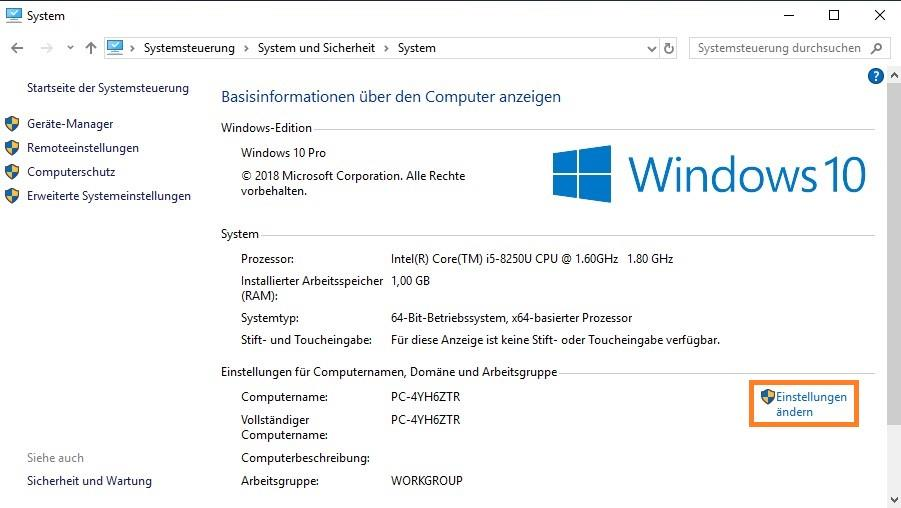
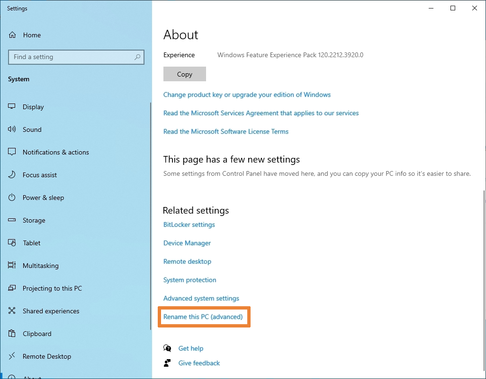

# "Windows-Client in die Domäne einbinden" - Taskdescription

## Einführung
In dieser Aufgabe soll der Domäne ein Client (Windows 10-Rechner) hinzugefügt werden. Ein Benutzer, mit dem man sich dann unter Windows 10 anmelden kann, wurde bereits in GK631 erstellt. Anschließend werden die am Server (GK631, GK632) vorgenommen Einstellungen getestet.

## Ziele
Ziel dieser Übung ist es, Windows-Systeme als Domänen-Clients kennenzulernen: wie unterscheidet sich die Benutzerverwaltung zwischen einem eigentständigen und einem in eine Domäne eingebundenen Windows-System? Welche Einstellungen am Domain Controller wirken sich wie auf die Client-Systeme aus? Welche Möglichkeiten von Windows sind als Domain Client eingeschränkt?

## Kompetenzzuordnung
#### GK SYT6 Betriebssysteme | Serverinstallation | Installation
* wichtige Serverrollen und darin die wichtigsten Funktionen anforderungsgerecht auswählen
* entsprechende Systeme installieren

#### GK SYT6 Betriebssysteme | Serverinstallation | Verzeichnisdienst
* entsprechende Services einrichten und konfigurieren

## Voraussetzungen
* GK Übung GK632 muss erfolgreich abgeschlossen sein

## Detaillierte Aufgabenbeschreibung

**Grundanforderungen**

### Windows 10 beziehen

Sofern du im TGM-Netzwerk ist, kannst du Windows Server vom Netzlaufwerk `\\filesrv-schueler\SCHUELER\hit\SYT\6_Semester\Software` herunterladen, ansonsten bei Microsoft Azure (siehe unten). Jedenfalls muss der Produktschlüssel von Microsoft Azure bezogen werden.

Um auf Microsoft Azure zuzugreifen, navigiere [hierher](https://azureforeducation.microsoft.com/devtools) und melde dich mit deinem TGM-Account an. Wähle dann "Software" ([Direktlink](https://portal.azure.com/#blade/Microsoft_Azure_Education/EducationMenuBlade/software)) und eine der Windows 10 Versionen. Es sollte rechts ein Panel mit Produktdetails und zwei Buttons erscheinen:

- **View Key:** zeige den Produktschlüssel für Windows 10 an.
- **Generate URL:** generiere einen begrenzt gültigen Download-Link für Windows 10.

### Installation Windows 10 in VMware Workstation:

Nachdem du zuletzt einen Microsoft Server installiert hast, sollte es kein Problem mehr sein Windows 10 in einer virtuellen Maschine zu installieren. Beachte folgende Punkte:

- Full Name: `win10admin`
- Passwort: `Password1!`
- Nicht automatisch einloggen; wir wollen ja einen Domänenbenutzer konfigurieren
- Bei der Installation wirst du nach einer Netzwerkverbindung gefragt. Diesen Schritt überspringen
- Mach nach Abschluss der Installation einen Snapshot der VM

An dieser Stelle macht es auch Sinn, über die Topologie des virtuellen Netzwerks nachzudenken. Wir wollen für die späteren Aufgaben weiter Internetzugang haben, also ist ein Host-Only Netzwerk nicht sinnvoll. Wir wollen die virtuellen Maschinen aber auch nicht nach außen sichtbar machen, damit fällt Bridged auch weg.

Es bleibt NAT, und das entspricht auch unseren Anforderungen: wir können einen eigenen DHCP-Server betreiben, der nicht zufällig anderen Computern im Netzwerk IP-Adressen zuweist, und die VMs haben Zugriff auf einander und auf das Internet.

### Einbinden des Windows 10 Clients in die Domäne

**Achtung:** Damit du den Client der Domäne hinzufügen kannst, muss der Server eingeschalten sein.

Um den Client in die Domäne aufzunehmen, öffne *Systemsteuerung > System und Sicherheit > System* (`Windows + Pause` führt z.B. direkt dort hin). Das führt entweder auf einen Teil der Systemsteuerung (klicke dort auf *Einstellungen ändern*) oder auf die *Settings* App, zu der man auch kommt wenn man im Startmenü *View your PC name* sucht (klicke dort auf *Rename this PC (Advanced)*)

Klicke dort auf *Ändern...*, ändere den Computernamen auf `PC01` und füge den Client der Domäne hinzu indem du *Mitglied von* > *Domäne* auswählst und dort den Namen deiner Domäne (`[nachname].at`) einträgst.

Diese Aktion muss von einem Domänenadministrator bestätigt werden, in userem Fall sind die Credentials als `Administrator`/`Password1!`.Nach einem Neustart ist der Client Mitglied der Domäne.

Klicke beim Anmeldebildschirm unten auf *Anderer Benutzer* und melde dich mit deinem Domänenbenutzer an. Wichtig ist, dass unter dem Anmeldefenster steht, dass du dich an deiner Domäne anmeldest. Sollte dies nicht der Fall sein, kannst du dich an der Domäne anmelden, indem du `[Domain]\[Benutzername]` oder `[Benutzername]@[Domain]` als Benutzername eingibst. Der lokale Administrator-Account wird in dieser Schreibweise als `PC01\win10admin` geschrieben.

### Testen der zuvor konfigurierten Serverdienste:

Kontrolliere jetzt, ob alle bisher vorgenommenen Einstellungen funktioniert haben:

- **Domänenbenutzer hinzufügen:** Du solltest dich mit deinem Domänenbenutzer am Client anmelden können.
- **Fileserver:** Du solltest vom Client Zugriff auf den Fileshare haben. Öffne dazu den Explorer und trage in die Adresszeile `\\dc01.[nachname].at\Allgemein` ein.
- **Gruppenrichtlinienobjekte:** Der Desktophintergrund sollte das von dir gewählte Bild sein. Es sollte nicht möglich sein diesen Hintergrund zu ändern.
- (EK) **DHCP:** Der Client sollte vom Server eine IPv4 Adresse beziehen. Am Client kannst du das in den Eigenschaften des Netzwerkadapters am DNS-Server und dem primären DNS-Suffix sehen; am Server sollte im *DHCP Manager* unter *DHCP > dc01.[nachname].at > IPv4 > Scope [NW address] [name] > Address Leases*. Hier solltest du den Client `PC01` sehen können.
- (EK) **IIS:** Öffne einen Browser am Client und gib als URL `intranet.[name].at` ein. Du solltest die von dir erstellte Testseite sehen.

## Fragestellungen
- Stelle eine "normale" Windows-Installation und einen Domänenclient in einem Firmenumfeld gegenüber. Welche Vor- oder Nachteile ergeben sich aus Administratoren- und User-Sicht in den beiden Szenarien?

## Abgabe
Die Abgabe wird elektronisch als PDF-Dokument erwartet. Dabei sollen die einzelnen Arbeitsschritte beschrieben (wo für einen Arbeitsschritt eine Anleitung exakt befolgt wurde reichen Stichworte) und die Fragen entsprechend ausgearbeitet werden. Bei dem obligatorischen Abgabegespräch wird die Dokumentation und die praktische Durchführung überprüft.

## Bewertung
Gruppengrösse: 1 Person
### Grundanforderungen **überwiegend erfüllt**
- [ ] Ausarbeitung der Fragestellungen
### Grundanforderungen **zur Gänze erfüllt**
- [ ] Vollständige Bearbeitung der grundlegenden Aufgabenstellungen
### Erweiterte Anforderungen **überwiegend erfüllt**
- [ ] Bearbeitung mindestens einer der zwei erweiterten Aufgabenstellungen (DHCP, Webserver testen)
### Erweiterte Anforderungen **zur Gänze erfüllt**
- [ ] Vollständige Bearbeitung der erweiterten Aufgabenstellungen

## Quellen
* "Systemtechnik Theorie Unterlagen" elearning; zuletzt besucht 2020-02-15; [online](https://elearning.tgm.ac.at/course/view.php?id=1939)

---
**Version** *20220227v2*
