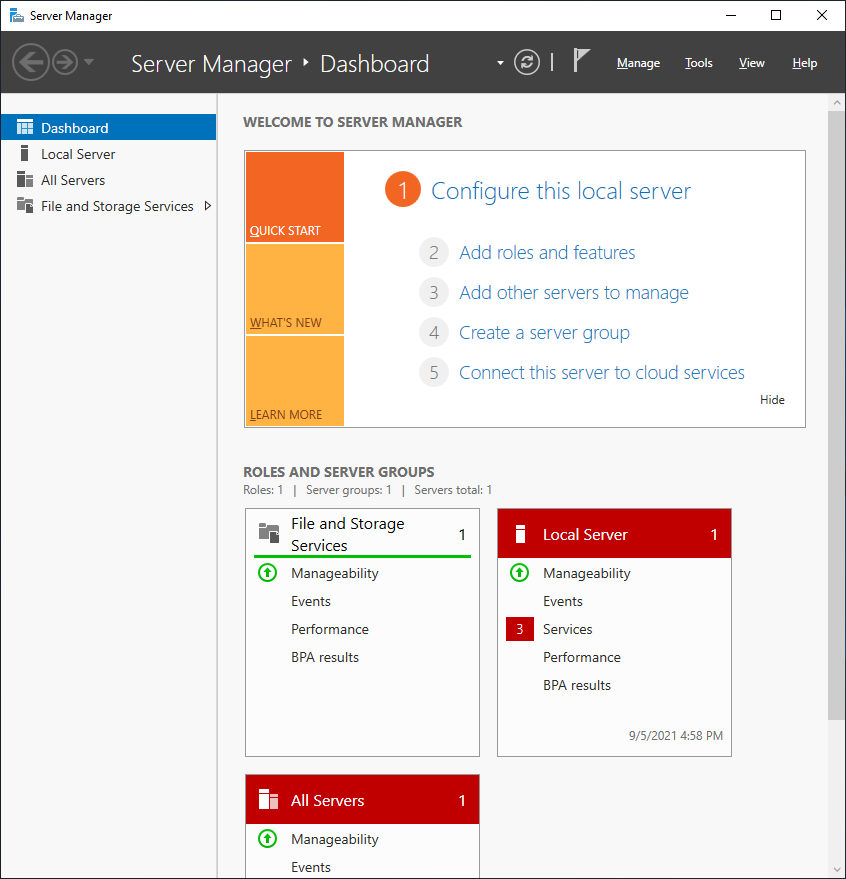
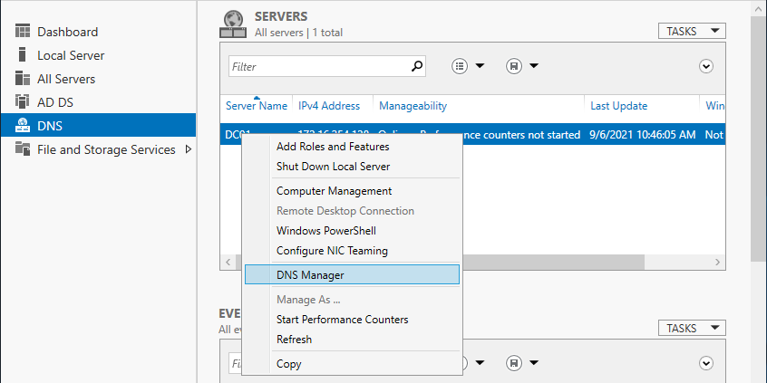
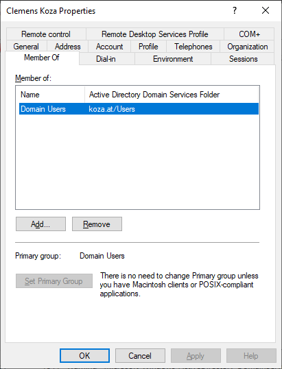

# "Domain Controller einrichten" - Taskdescription

## Einführung
Diese Aufgabe soll die Verwendung eines Windows Server als Grundlage für ein Windows-Netzwerk demonstrieren. Im Wesentlichen besteht die Aufgabe aus folgenden Schritten:
- Software beziehen
- Windows Server 2019 installieren
- Active Directory und Domäne konfigurieren
- DNS konfigurieren

## Ziele
Ziel dieser Übung ist es, alle notwendigen Schritte zur Installation eines Windows Servers und der Erstellung eines grundlegenden Windows-Netzwerks kennenzulernen. Dabei wird neben dem Server-Betriebssystem ein Verzeichnisdienst (Active Directory) und ein Windows-Netzwerk (Domäne) eingerichtet. Weiters wird auch DNS eingerichtet, was für den Betrieb eines Domaincontrollers Voraussetzung ist.

## Kompetenzzuordnung
#### GK SYT6 Betriebssysteme | Serverinstallation | Installation
* wichtige Serverrollen und darin die wichtigsten Funktionen anforderungsgerecht auswählen
* entsprechende Systeme installieren

#### GK SYT6 Betriebssysteme | Serverinstallation | Verzeichnisdienst
* Verzeichnisdienste und deren Einsatzmotivation erläutern und entsprechende Services einrichten und konfigurieren

## Voraussetzungen
- Grundlegendes Verständnis von Netzwerken (Adressierung, Client-Server Architektur)
- Grundlegendes Verständnis von Virtualisierungssoftware und deren verschiedener Netzwerkmodi (NAT, Bridged, Host-only)
- Grundlegendes Verständnis von Diensten wie DHCP und DNS

## Detaillierte Aufgabenbeschreibung - Grundanforderungen

### Theorie

Mach dich über das Dokument [Serverinstallation und Konfiguration](https://elearning.tgm.ac.at/pluginfile.php/251071/mod_resource/content/1/Serverinstallation.pdf) und das folgende Video mit den in weiterer Folge benötigten Themen vertraut:

[Introduction to Active Directory Directory Services Structure in Windows Server 2012](https://www.youtube.com/watch?v=lFwek_OuYZ8)

### VMware Workstation beziehen

Die VMware wird seit SJ 2021_22 über Brightspace angeboten. 
Um darauf zuzugreifen zu können, navigiere [hierher](https://itacademy.vmware.com/myaccount/l/redeem?ml_token=0962fb2b9c49ab05dbb0ed209a8918d3) und folge den Anweisungen.
Siehe hierzu auch die Email von "info@itacademy.brightspace.com" vom Dienstag, 14.12.2021 am Abend und der Nachricht von POSA0 am Mittwoch, 15.12.2021 mit dem Betreff "vmWare Lizenz für 2-5xHIT". Bei Fragen komme auf deine SYT-Lehrkraft zu.

### Windows Server beziehen

Sofern du im TGM-Netzwerk ist, kannst du Windows Server vom Netzlaufwerk `\\filesrv-schueler\SCHUELER\hit\SYT\6_Semester\Software` herunterladen, ansonsten bei Microsoft Azure (siehe unten). Jedenfalls muss der Produktschlüssel von Microsoft Azure bezogen werden.

Um auf Microsoft Azure zuzugreifen, navigiere [hierher](https://azureforeducation.microsoft.com/devtools) und melde dich mit deinem TGM-Account an. Wähle dann "Software" ([Direktlink](https://portal.azure.com/#blade/Microsoft_Azure_Education/EducationMenuBlade/software)) und klicke auf den "Windows Server 2022 Standard". Es sollte rechts ein Panel mit Produktdetails und zwei Buttons erscheinen:

- **View Key:** zeige den Produktschlüssel für Windows Server an.
- **Generate URL:** generiere einen begrenzt gültigen Download-Link für Windows Server.

### Betriebssysteminstallation

Jetzt muss Windows Server 2022 in einer virtuellen Maschine installiert werden. Diese und folgende Übungen gehen davon aus, dass dafür VMware benutzt wird!

Wähle in VMware zuerst *File > New Virtual Machine...* (Ctrl+N). Klicke dich durch den Wizard und triff wo nötig folgende Einstellungen:

- **Use ISO image:** dein heruntergeladenes Image von Windows Server 2022
- **Windows Product Key:** dein Schlüssel laut Microsoft Azure
- **Version of Windows to install:** Windows Server 2022 Standard
- **Name:** wähle `Administrator`; du wirst noch einen Benutzer mit deinem Namen anlegen, das schützt vor Verwechslungen und Unklarheiten
- **Password:** wähle `Password1!`; wenn dein Lehrer deine VM bedienen soll ist es praktisch, wenn alle das gleiche Passwort benutzen.
- **Log on automatically:** ja

Wähle bei der Installation die "Desktop Experience", also Windows Server inklusive GUI. Nach erfolgreicher Installation sollte das Dashboard des Servermanagers zu sehen sein:

Jetzt müssen einige grundlegende Einstellungen vorgenehmen werden; klicke dazu auf *1 - Configure this local server*:

- **Computer name:** ein menschenlesbarer Name macht es uns später einfacher, den Server über DNS zu erreichen. Klicke auf den aktuellen Wert, dann *Change...* und ändere den Namen auf `DC01`.
- **Ethernet0:** als Server sollte diese VM immer die gleiche IP-Adresse besitzen. Vergib deshalb eine statische IP - und zwar die gleiche, die auch bisher per DHCP benutzt wird.
	
	(Das ist nicht ganz ideal - normalerweise sollten statische Adressen von *außerhalb* des per DHCP vegebenen Adressbereich genommen werden, der Adressbereich von WMware's DHCP Server lässt sich aber leider nicht ändern. Später werden wir aber sowieso einen eigenen DHCP-Server benutzen.)
	- klicke auf *IPv4 address assigned by DHCP, IPv6 enabled*
	- wähle im Kontextmenü (Rechtsklick) Netzwerkkarte *Status* und dann *Details...* und merke dir den Wert bei *IPv4 Address*, *IPv4 Subnet Mask*, *IPv4 Default Gateway* und *IPv4 DNS Server*
	- schließe die Details und wähle *Properties*; markiere den Eintrag *Internet Protocol Version 4 (TCP/IPv4)*, wähle *Properties*; wähle *Use the following IP address:* und trage die entsprechenden Daten (inklusive DNS Server) ein.

Jetzt ist die VM bereit für die weiteren Aufgaben; mache jetzt einen **Snapshot** damit du diesen Zustand Notfalls wiederherstellen kannst.

### Active Directory und Domäne konfigurieren

Unter Windows Server werden verschiedene Dienste und deren Teile als "Rollen" und "Features" bezeichnet, im Laufe dieser und der nächsten Übungen wirst du deinem Server einige davon hinzufügen. Die Schritte laufen immer ähnlich ab wie hier.

Grundlage eines Windows-Netzwerks ist die Active Directory Domäne und ihr Domain Controller. Geh also so vor, um dem Server die Rolle "Active Directory Domain Services" hinzuzufügen:

- wähle entweder im Dashboard *2 - Add roles and features* oder *Manage > Add Roles and Features*
- klicke bei *Before You Begin* auf *Next* - du kannst auch ruhig *Skip this page by default* auswählen
- *Role-based or feature-based installation* passt - *Next*
- alle Rollen werden auf unserem Server `DC01` installiert - *Next*
- wähle jetzt die hinzuzufügende Rolle aus (*Active Directory Domain Services*) und bestätige die benötigten features mit *Add Features* - *Next*
- die nötigen Features wurden im vorigen Schritt schon aktiviert - *Next*
- der nächste Screen ist rollenspezifisch; hier ist nichts zu tun - *Next*
- schließlich - *Install*

Nach der Installation von Rollen gibt es häufig noch eine *Post-deployment Configuration* - in diesem Fall *Promote this server to a domain controller*. Klicke entweder im Installations-Dialog auf den Link, oder stattdessen in den Notifications des Servermanagers.

- Wähle *Add a new forest* und als *Root domain name* `[nachname].at`, also z.B. `koza.at` - *Next*
- Wähle ein beliebiges DSRM-Passwort - *Next*
- wir erstellen keine DNS Delegation
- Alles weitere - *Next*, *Install*

Nach der Installation startet der Server automatisch neu. Die DNS-Rolle wurde automatisch mitinstalliert, jetzt muss der DNS-Server noch konfiguriert werden. Zu den Einstellungen einer Rolle zu kommen geht auch bei allen zukünftig installierten Rollen ähnlich: wähle entweder in der linken Sidebar des Server Managers *DNS*, dann im Kontextmenü des Servers `DC01` *DNS Manager*, oder im Menü *Tools > DNS*.

- gehe in der Sidebar auf *DC01.[nachname].at > Reverse Lookup Zones* und wähle im Kontextmenü *New Zone...*
- klick dich durch, bis die *Network ID* angegeben werden muss; gib den Netzwerk-Teil der IP-Adresse des Servers ein
- schließe den Wizard ab
- wähle im Kontextmenü der Zone *New Pointer (PTR)...*
- gib bei *Host IP Address* die IP des Servers an, bei *Hostname* `dc01.[nachname].at`
- bestätige den Dialog

Damit ist der Domaincontroller bereit! Mache am besten wieder einen **Snapshot**.

### Domänenbenutzer hinzufügen

Damit man sich später mit einem Client an der Domäne anmelden kann, braucht es einen Domänenbenutzer. Öffne dazu das Tool "Active Directory Users and Computers" über das *Tools* Menü oder über den *AD DS* Reiter des Servermanagers im Kontextmenü deines Servers.

- gehe in der Sidebar auf *[nachname].at > Users* und wähle im Kontextmenü *New > User*
- Verwende deinen echten Namen und dein TGM-Kürzel für den Account, z.B. "Clemens Koza", "ckoza"
- Gib als Password `Password1` ein; wir wollen am Ende wieder `Password1!` haben, der Benutzer soll aber beim ersten Login das Passwort ändern müssen.

Nachdem der neue Benutzer angelegt wurde, kannst du mit Doppelklick auf dessen Namen die Details des Kontos ansehen. Hier können noch weitere Informationen eingetragen, der Benutzer zu Gruppen hinzugefügt werden und vieles mehr. Unter dem Reiter „Member of“ siehst du in welchen Gruppen der Benutzer Mitglied ist. Standardmäßig ist ein neuer Benutzer nur Mitglied der Gruppe Domain Users.

## Fragestellungen
- Erkläre in eigenen Worten den Unterschied zwischen Software- und Hardware-Servern.
- Welche Vorteile bietet eine Virtualisierung der Serverinfrastruktur?
- Welche Vorteile bringt Microsoft Active Directory Domain Services in Unternehmensnetzwerken?
- Beschreibe kurz folgende Begriffe: Domain, Tree, Forest.

## Abgabe
Die Abgabe wird elektronisch als PDF-Dokument erwartet. Dabei sollen die einzelnen Arbeitsschritte beschrieben (wo für einen Arbeitsschritt eine Anleitung exakt befolgt wurde reichen Stichworte) und die Fragen entsprechend ausgearbeitet werden. Bei dem obligatorischen Abgabegespräch wird die Dokumentation und die praktische Durchführung überprüft.

## Bewertung
Gruppengrösse: 1 Person
### Grundanforderungen **überwiegend erfüllt**
- [ ] Ausarbeitung der Fragestellungen
### Grundanforderungen **zur Gänze erfüllt**
- [ ] Vollständige Bearbeitung der Aufgabenstellungen

## Quellen
* "Systemtechnik Theorie Unterlagen" elearning; zuletzt besucht 2020-02-15; [online](https://elearning.tgm.ac.at/course/view.php?id=1939)

---
**Version** *20220311v3*
