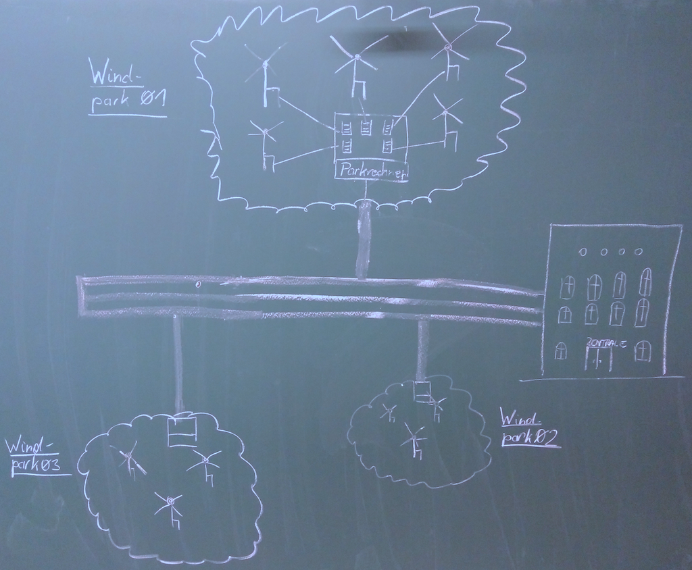

# Middleware Engineering "Document Oriented Middleware using MongoDB" - Taskdescription
Join GIT repository: [https://classroom.github.com/a/4iJH7nWS](https://classroom.github.com/a/4iJH7nWS)  

## Einführung

Diese Übung soll helfen die Funktionsweise und Einsatzmöglichkeiten eines dokumentenorientierten dezentralen Systems mit Hilfe des Frameworks Spring Data MongoDB zu demonstrieren. Die Daten werden in dieser Übung in einem NoSQL Repository gespeichert und verarbeitet.

Es handelt sich um die Fortsetzung von Beispiel zu Windkraftanlagen, GEK Middleware Engineering "Message Oriented Middleware". Mit Hilfe einer REST Schnittstelle auf den Parkrechnern sollen die Daten an die Zentrale weitergegeben und hier mit Hilfe eines dokumentenorientiertem dezentralen Systems gespeichert werden. Von diesem System können die Daten für verschiedene Anwendungsfälle weiterverarbeitet werden.

## 1.1 Ziele

Das Ziel dieser Übung ist die Implementierung einer dokumentenorientierten Middleware, die die Daten der Windparks zentral in einer entsprechenden Format ablegt.

## 1.2 Voraussetzungen

* Grundlagen zu XML & JSON & REST
* Grundlagen Architektur von verteilten Systemen
* Grundlagen Spring Framework und Spring Boot
* Grundlagen NoSQL
* Installation MongoDB
* Implementierung der Aufgabenstellungen bis GEK Middleware Engineering "Message Oriented Middleware"
* Umsetzung eines einfachen Web-Userinterfaces zur Anzeige von Daten

## 1.3 Aufgabenstellung

Implementieren Sie eine dokumentenorientierte Middleware mit Hilfe von Spring Data MongoDB und holen Sie die aktuellen Daten der REST Schnittstelle der Parkrechner ab. Es sollen dabei keine Daten verloren gehen, sondern stets mit einem Zeitstempel und einem entsprechenden Format in der Zentrale abgespeichert werden. Bedenken Sie, dass die Daten aller Windparks und somit aller Windkraftanlagen zusammentreffen. Entwerfen Sie eine geeignet Datenstruktur, um eine kontinuierliche Speicherung der Daten zu gewährleisten.

Die Daten liegen im JSON- bzw. XML-Format am Parkrechner vor und sollen als JSON-Struktur in MongoDB gespeichert werden. In welchem Format und in welchen Zeitabständen die Daten eintreffen wird von Ihnen, als System Architekt, spezifiziert und implementiert.

Die Daten werden in der Zentrale in einem MongoDB Repository gespeichert und können hier zu Kontrollzwecken abgerufen werden (mongo Shell).

Ebenso soll ein einfaches Webinterface für die Zentrale implementiert werden, die die Daten anhand einer von Ihnen gewählten Fragestellung auswertet und diese im Browser darstellt. Dabei soll die einfache Verarbeitung der Daten, die im JSON Format vorliegen, aufgezeigt werden.

## 1.4 Demo Applikation

* Download Docker for MongoDB  
  `docker pull mongo`  

* Run Docker for MongoDB (using port 27017, name mongo)  
  `docker run -d -p 27017:27017 --name mongo mongo`  

* Run MongoShell on Docker Instance  
  `docker exec -it mongo bash`
  `mongo`  

* Execute MongoShell Commands  
	`show dbs`  
	`use local`  
	`db.startup_log.count();`  

* Accessing Data with MongoDB and Spring  
  - Build and Run Exmample  
	  `mvn clean install`  
	  `mvn spring-boot:run -Dspring.data.mongodb.uri=mongodb://localhost:27017/customer`  

  - Check Data in MongoDB  
		`docker exec -it mongo bash`  
		`mongo`  
		`use test`  
		`db.windengineData.find()`  
	  	``

## 1.5 Bewertung  

*   Gruppengrösse: 1 Person
*   Abgabemodus: per Protokoll, bei EK kann ein Abgabegespraech erforderlich sein
*   Anforderungen **"überwiegend erfüllt"**
    * Installation und Konfiguration einer dokumentenorientierten Middleware mit Hilfe von Spring Data MongoDB
    * Entwurf und Umsetzung einer entsprechenden JSON Datenstruktur
    * Speicherung der Daten in einem MongoDB Repository in der Zentrale
    * Umsetzung von einem Parkrechner
    * Beantwortung der Fragestellungen   
*   Anforderungen **"zur Gänze erfüllt"**
    * Formulierung 3 sinnvollen Fragestellung für einen Anwendungsfall in der Zentrale und deren Abfragen in einer Mongo Shell
*  Erweiterte Anforderungen **überwiegend erfüllt**
    * Umsetzung von mehreren Parkrechnern
    * Konzeption und Implementierung der kontinuierlichen Speicherung der Daten (Cronjob, Scheduler, Trigger, etc.)
*  Erweiterte Anforderungen **zur Gänze erfüllt**
    *   Implementieren eines Webinterfaces zur Darstellung der Daten

## 1.6 Fragestellung für Protokoll

+ Nennen Sie 4 Vorteile eines NoSQL Repository im Gegensatz zu einem relationalen DBMS
+ Nennen Sie 4 Nachteile eines NoSQL Repository im Gegensatz zu einem relationalen DBMS
+ Welche Schwierigkeiten ergeben sich bei der Zusammenführung der Daten?
+ Welche Arten von NoSQL Datenbanken gibt es?
+ Nennen Sie einen Vertreter für jede Art?
+ Beschreiben Sie die Abkürzungen CA, CP und AP in Bezug auf das CAP Theorem
+ Mit welchem Befehl koennen Sie die Windgeschwindigkeit von Windkraftanalage 1 vom Windpark 1 in der Shell auf 0 setzen?

## 1.7 Links und Dokumente
* [Accessing Data with MongoDB](https://spring.io/guides/gs/accessing-data-mongodb/)
* [MongoDB Installation](https://docs.mongodb.com/manual/administration/install-community/)
* [mongo Shell Quick Reference](https://docs.mongodb.com/manual/reference/mongo-shell/)
* [Grundlagen Spring Framework](https://spring.io/)
* [Spring Boot](https://spring.io/guides/gs/spring-boot/)
* [Spring Data MongoDB](https://spring.io/projects/spring-data-mongodb)
* [Spring RESTful Web Service](https://spring.io/guides/gs/rest-service/#use-maven)
* NoSQL Introduction
  - [NoSQL on w3resource](https://www.w3resource.com/mongodb/nosql.php)  
  - [Introduction to NoSQL Database](https://www.edureka.co/blog/introduction-to-nosql-database/)  
  - [NoSQL im Überblick](https://www.heise.de/ct/artikel/NoSQL-im-Ueberblick-1012483.html)  
  - [Introduction to NoSQL Databases on YouTube ](https://www.youtube.com/watch?v=2yQ9TGFpDuM)  
