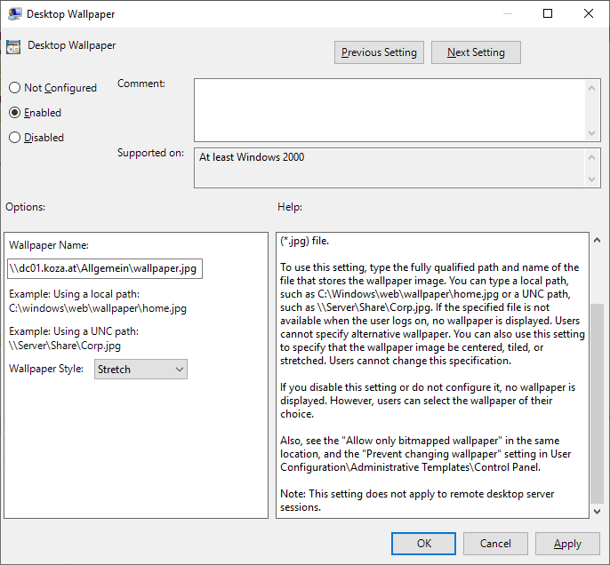
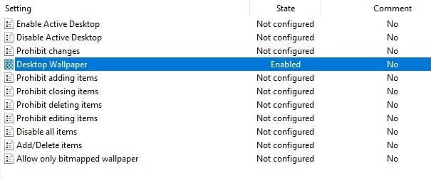
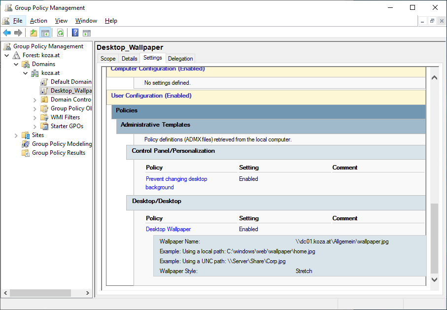
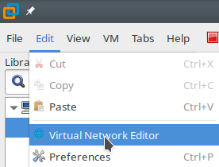
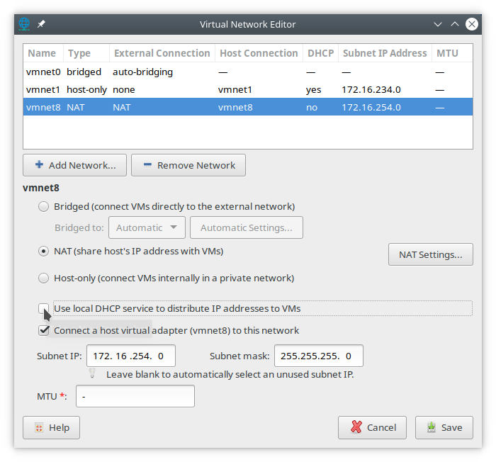
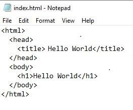

# "Rollen und Services einrichten" - Taskdescription

## Einführung
In dieser Aufgabe soll die Domäne um zusätzliche typische Einstellungen und Services erweitert werden. Die notwendigen Konfigurationen werden direkt am bereits erstellten Domain Controller hinzugefügt. Dazu gehören: DHCP, Fileserver, Webserver, Gruppenrichtlinien.

## Ziele
Ziel dieser Übung ist es, in Windows-Netzwerken verfügbare Funktionalitäten kennenzulernen und umsetzen zu können.

## Kompetenzzuordnung
#### GK SYT6 Betriebssysteme | Serverinstallation | Installation
* wichtige Serverrollen und darin die wichtigsten Funktionen anforderungsgerecht auswählen

#### GK SYT6 Betriebssysteme | Serverinstallation | Verzeichnisdienst
* entsprechende Services einrichten und konfigurieren

## Voraussetzungen
* GK Übung GK631 muss erfolgreich abgeschlossen sein

## Detaillierte Aufgabenbeschreibung - Grundanforderungen

Gehe die folgenden Anleitungen durch, um zusätzliche Rollen und Services zu deiner Domäne hinzuzufügen:

### Fileserver konfigurieren

Zunächst werden wir unseren Server zum Fileserver machen. Füge dem Server dafür die Rolle *File and Storage Services > File and iSCSI Services > File Server Resource Manager* hinzu.

Wähle jetzt in der linken Sidebar des Server Managers *File and Storage Services > Shares* und dann rechts oben *TASKS > New Share...*.

- **File share profile:** *SMB Share - Advanced*
- **Share name:** "Allgemein"
- **Share description:** "Ablage für diverse Dokumente"
- wähle zusätzlich *Enable access-based enumeration* aus; *Allow caching of share* bleibt auch aktiviert
- **Management Properties:** wähle *Group Files* aus
- **Quota:** wähle *100 MB Limit* aus

### Gruppenrichtlinienobjekte erstellen und anwenden:

Gruppenrichtlinienobjekte oder Group Policy Objects (GPOs) setzen für eine Gruppe eine oder mehrere Richtlinien, legen also bestimmte Einstellungen für ausgewählte Benutzer und/oder Computer fest - optional so, dass diese Einstellungen nicht geändert werden können.

Als Beispiel werden wir für alle Benutzer einen Desktophintergrund festlegen; das Hintergrundbild wird im *Allgemein* Share hinterlegt. Lade dir dazu ein Wallpaper deiner Wahl aus dem Internet herunter. Speichere dieses Bild  unter `C:\Shares\Allgemein`.

Wähle im Server Manager *Tools > Group Policy Management*, dann *Forest: [nachname].at > Domains > [nachname].at* und dann im Kontextmenü *Create a GPO in this domain, and link it here...*. Gib als Name "Desktop_Wallpaper" an.

Wähle im Kontextmenü des neuen GPO "Edit..." und navigiere dann links zu *User Configuration > Policies > Administrative Templates > Desktop > Desktop*. Wähle dann auf der rechten Seite "Desktop Wallpaper" mit der rechten Maustaste aus und klicke auf "Edit".

Wähle im neuen Fenster *Enabled* und wähle bei *Wallpaper Name* das zuvor heruntergeladene Bild aus. Der Pfad sollte wie folgt aussehen: `\\dc01.[nachname].at\Allgemein\[dein_wallpaper]` - ein Pfad beginnend mit `C:\` würde am Client nicht gefunden werden, deswegen muss ein UNC-Pfad benutzt werden! Wähle auch den *Wallpaper Style* passend zu deinem Bild wählen.

Nachdem die Einstellungen konfiguriert wurden, sollte man bei dieser Option im Group Policy Management Editor sehen können, dass diese nun aktiviert ist.

Navigiere nun links zu *User Configuration > Policies > Administrative Templates > Control Panel > Personalization*. Wähle dann rechts den Punkt "Prevent changing desktop background" aus. Setze auch diese Option auf "Enabled".

Du kannst nun den Group Policy Management Editor schließen. Wenn du nun das angelegte GPO auswählst, kannst du auf der rechten Seite den Reiter "Settings" auswählen. Hier siehst du alle Einstellungen, die in diesem GPO konfiguriert wurden.

## Detaillierte Aufgabenbeschreibung - Erweiterungen

Gehe die folgenden Anleitungen durch, um zusätzliche Rollen und Services zu deiner Domäne hinzuzufügen:

### DHCP Rolle konfigurieren:

Unser Server soll in unserem Netzwerk auch als DHCP-Server fungieren. Dazu müssen wir zunächst den DHCP-Dienst von VMware Workstation beenden. Fahre dazu den Server herunter. Klicke dann in VMware Workstation auf den Reiter "Edit" und dann auf "Virtual Network Editor".

Der Server sollte standardmäßig per NAT an das physische Netzwerk angeschlossen sein, editiere also das NAT-Interface (z.B. `vmnet8`) und entferne das Häkchen bei *Use local DHCP service to distribute IP addresses to VMs*.

Starte nun den Server wieder. Füge dem Server die Rolle *DHCP Server* hinzu. Nach der Installation steht wieder eine *Post-deployment Configuration* an; klicke im Installationsfenster oder in den Benachrichtigungen des Server Managers auf *Complete DHCP configuration*. Behalte alle Einstellungen bei.

Nachdem der DHCP-Server einsatzbereit ist fehlen noch die tatsächlichen DHCP-Einstellungen: es müssen noch die Subnetze konfiguriert werden, damit IP-Adressen vergeben werden können. Von VMware haben wir ein Klasse-C-Netzwerk (z.B. `172.16.254.0/24`) zur Verfügung; wir werden diesen Adressraum nicht weiter in kleinere Subnetze aufteilen. Wir müssen nur sicherstellen, dass wir die IP-Adressen des Standard-Gateways und des Servers selbst nicht per DHCP vergeben. Das werden wir in der folgenden Konfiguration sicherstellen.

Wähle links im Server Manager *DHCP* und im Kontextmenü des Servers *DHCP Manager*, oder alternativ *Tools > DHCP*. (Alle Adressen müssen ggf. an das eigene Netzwerk angepasst werden!)

- navigiere in der Sidebar zu *DC01.[nachname].at > IPv4*
- wähle im Kontextmenü *New Scope...*
- vergib einen Namen und eine Beschreibung für das neue Subnetz (Vorschlag: Initialen + 1 (z.B. `ck1`), "Subnet 1")
- vergib den Großteil oder den gesamten Adressbereich per DHCP:
	- **Start IP address:** z.B. `172.16.254.1`
	- **End IP address:** z.B. `172.16.254.254`
	- **Subnet Mask:** z.B. `255.255.255.0`
- stelle mit Exclusions sicher, dass statisch vergebene IPs nicht per DHCP vergeben werden:
	- das Standard-Gateway des VMware-Netzes könnte z.B. `172.16.254.2` sein. Mach gleich eine Exclusion für einige niedrige Adressen: z.B. `172.16.254.1`-`172.16.254.20`
	- stell auch sicher, dass die Server-IP von der automatischen Vergabe ausgeschlossen ist, z.B. mit einer einzelnen exkludierten Adresse `172.16.254.128`
- **Router (Default Gateway):** z.B. `172.16.254.2`

### IIS (Webserver) konfigurieren:

Nun werden wir noch einen Webserver auf unserem Server einrichten. Füge dazu dem Server die Rolle *Web Server (IIS)* hinzu. Bei den "Role Services" ist während der Installation nichts einzustellen.

Wähle links im Server Manager *IIS* und im Kontextmenü des Servers *Internet Information Services (IIS) Manager*, oder alternativ *Tools > Internet Information Services (IIS) Manager* aus.

- navigiere in der Sidebar zu *DC01 ([NACHNAME]\Administrator) > Sites > Default Web Site*
- wähle im Kontextmenü *Explore*
- lege dort eine neue Datei "index.html" an

Erstelle in der Datei eine Testseite; Beispiel:

Damit die Website in unserem Netzwerk mit einem sprechenden Namen erreichbar ist, müssen wir einen DNS Namen vergeben. Öffne dazu den DNS Manager.

- navigiere links zu *DC01.[nachname].at > Forward Lookup Zones > [name].at*
- wähle im Kontextmenü „New Alias (CNAME)...“
	- **Alias name:** `intranet`
	- **FQDN for target host:** `dc01.[nachname].at`

Damit sollte die Webseite (und auch alle anderen Services die auf `DC01` gehostet werden) sowohl unter `dc01.[nachname].at` als auch unter `intranet.[nachname].at` erreichbar sein.

## Fragestellungen
- Erstelle eine Liste mit den wichtigsten Serverrollen und -diensten. Beschreibe die einzelnen Dienste in Stichworten.
- Welche der kennengelernten Serverrollen sollten redundant ausgeführt werden? Begründe deine Wahl.

## Abgabe
Die Abgabe wird elektronisch als PDF-Dokument erwartet. Dabei sollen die einzelnen Arbeitsschritte beschrieben (wo für einen Arbeitsschritt eine Anleitung exakt befolgt wurde reichen Stichworte) und die Fragen entsprechend ausgearbeitet werden. Bei dem obligatorischen Abgabegespräch wird die Dokumentation und die praktische Durchführung überprüft.

## Bewertung
Gruppengrösse: 1 Person
### Grundanforderungen **überwiegend erfüllt**
- [ ] Ausarbeitung der Fragestellungen
### Grundanforderungen **zur Gänze erfüllt**
- [ ] Vollständige Bearbeitung der grundlegenden Aufgabenstellungen
### Erweiterte Anforderungen **überwiegend erfüllt**
- [ ] Bearbeitung mindestens eine der zwei erweiterten Aufgabenstellungen (DHCP, Webserver)
### Erweiterte Anforderungen **zur Gänze erfüllt**
- [ ] Vollständige Bearbeitung der erweiterten Aufgabenstellungen

## Quellen
* "Systemtechnik Theorie Unterlagen" elearning; zuletzt besucht 2020-02-15; [online](https://elearning.tgm.ac.at/course/view.php?id=1939)

---
**Version** *20220227v2*
