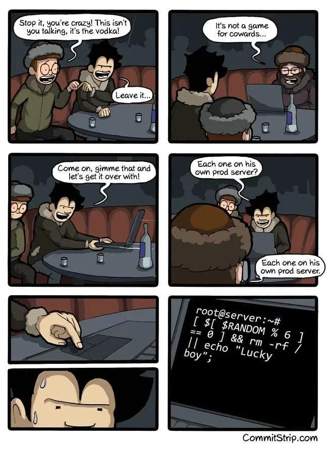

---
hide:
  - navigation
---

# "*Linux Systemwartung*" - Taskdescription

## Kompetenzzuordnung
#### GK SYT6 Betriebssysteme | Servermanagement | Wartung
* "Vorteile der Wartungsautomatisierung erklären"
* "Wartung über die Shell durchführen"
#### EK SYT6 Betriebssysteme | Servermanagement | Wartung
* "Betriebssysteme automatisch installieren"

## Voraussetzungen
* Grundverständnis von Netzwerk und Betriebssystemkonfiguration
* Grundverständnis von virtuellen Maschinen und dem Einsatz eines Hypervisors
* Grundverständnis und Handhabung von GNU/Linux Systemen (Shell)

## Fragestellungen

### Grundlegend

* Welche Distribution verwendest du? Wie lange wird diese noch mit Updates versorgt (EOL)? Was kann danach getan werden? [^7][^23][^24][^32][^33][^36]
* Wie werden Dienste bzw. Services aktuell in Linux verwaltet? Welche Administrationsmöglichkeit werden hier angeboten? [^8][^29]
* Wie werden Systemprozesse organisiert und wer kümmert sich um deren Aufruf und Verwaltung? [^17]
* Wie kann man sich einen Prozessbaum vorstellen und welche Abhängigkeiten gibt es hier? [^31](Kapitel 10)
* Welche verschiedenen Signale zum Beenden eines Prozesses gibt es? Wo liegen hier die Unterschiede? [^9][^19][^20][^26][9, 19, 20, 26]
* Wie können die wichtigen Ressourcen eines Serversystems administriert werden? Wo legt der Kernel die Informationen dafür ab? [^6][^16][^22][^28][^35]
* Wie ist das Logging-System in aktuellen, linuxbasierten Systemen aufgebaut? Welche verschiedene Möglichkeiten gibt es hierfür? [^15][^18]
* Wie können Netzwerkverbindungen in Linux-Systemen analysiert werden? Wie kann eine sichere Verbindung zu einem Server hergestellt werden? [^1][^27]
* Wie kann das System automatisiert auf dem neusten Stand gehalten werden? Welche Möglichkeiten gibt es hierzu? [^2][^13][^14][^34]
* Vergleiche die Task-Scheduler `cron` und `systemd timers`. Welche Vor- und Nachteile haben die beiden Dienste? [^3][^4][^4][^5][^10][^11][^12][^25][^30]

## Abgabe
Die einzelnen Teile sind der Reihe nach zu lösen, da gewisse Abhängigkeiten in der Umsetzung als auch in der Komplexität gegeben sind. Meist ist die Verwendung der Manpage ausreichend. Die ausgeführten Befehle sind entsprechend zu dokumentieren und auch verwendete Hilfsmittel sind als Quellen anzugeben. Es bietet sich an, die Dokumentation in Markdown zu verfassen und diese auch für den Eigengebrauch abzulegen. Screenshots sind nur bedingt hilfreich, wenn man Befehle oder Quellcode schnell wieder verwenden möchte.

## Quellen
[^1]: M. Dancuk, „28 Netstat Commands {A Comprehensive List With Examples}“, Knowledge Base by phoenixNAP, 28. Jänner 2021. [online](https://phoenixnap.com/kb/netstat-command) (zugegriffen 19. März 2023).   
[^2]: „Automatische Updates (Debian) – MattWiki“. [online](https://otremba.net/wiki/Automatische_Updates_(Debian)) (zugegriffen 19. März 2023).   
[^3]: „Crontab Explained in Linux [With Examples]“, Linux Handbook, 26. November 2019. [online](https://linuxhandbook.com/crontab/) (zugegriffen 19. März 2023).   
[^4]: „Crontab Generator - Generate crontab syntax“. [online](https://crontab-generator.org/) (zugegriffen 23. April 2023).   
[^5]: „Crontab.guru - The cron schedule expression editor“. [online](https://crontab.guru/) (zugegriffen 23. April 2023).   
[^6]: „Das /proc-Dateisystem - LINUX - PRAXIS“. [online](https://www.linux-praxis.de/das-proc-dateisystem) (zugegriffen 23. April 2023).   
[^7]: „DebianReleases - Debian Wiki“. [online](https://wiki.debian.org/DebianReleases) (zugegriffen 19. März 2023).   
[^8]: dgarn, „Getting started with systemctl“, Enable Sysadmin. [online](https://www.redhat.com/sysadmin/getting-started-systemctl) (zugegriffen 19. März 2023).   
[^9]: R. V. D. Paar, „How Linux Signals Work: SIGINT, SIGTERM, and SIGKILL“, How-To Geek, 20. Mai 2021. [online](https://www.howtogeek.com/devops/linux-signals-hacks-definition-and-more/) (zugegriffen 19. März 2023).   
[^10]: A. Oliveira, „How to schedule jobs using the Linux ‚cron‘ utility“, Enable Sysadmin. [online](https://www.redhat.com/sysadmin/linux-cron-command) (zugegriffen 19. März 2023).   
[^11]: E. Docile, „How to schedule tasks with systemd timers in Linux“, Linux Tutorials - Learn Linux Configuration, 29. Mai 2020. [online](https://linuxconfig.org/how-to-schedule-tasks-with-systemd-timers-in-linux) (zugegriffen 19. März 2023).   
[^12]: V. Kaplarevic, „How to Set Up a Cron Job in Linux? {Schedule Tasks} | PhoenixNAP KB“, Knowledge Base by phoenixNAP, 9. Jänner 2020. [online](https://phoenixnap.com/kb/set-up-cron-job-linux) (zugegriffen 19. März 2023).   
[^13]: „How to Set up SSH Tunneling (Port Forwarding)“, 8. August 2019. [online](https://linuxize.com/post/how-to-setup-ssh-tunneling/) (zugegriffen 23. April 2023).   
[^14]: D. Mckay, „How to Use netstat on Linux“, How-To Geek, 17. Februar 2020. [online](https://www.howtogeek.com/513003/how-to-use-netstat-on-linux/) (zugegriffen 19. März 2023).   
[^15]: K. Buzdar, „How to watch or monitor log files in Debian 10“, VITUX, 17. Juni 2021. [online](https://vitux.com/how-to-watch-or-monitor-log-files-in-debian-10/) (zugegriffen 19. März 2023).   
[^16]: khess, „Important Linux /proc filesystem files you need to know“, Enable Sysadmin, 23. März 2020. [online](https://www.redhat.com/sysadmin/important-proc-files) (zugegriffen 23. April 2023).   
[^17]: „Linux Jargon Buster: What are Daemons in Linux?“, It’s FOSS, 25. Mai 2021. [online](https://itsfoss.com/linux-daemons/) (zugegriffen 19. März 2023).   
[^18]: schkn, „Linux Logging Complete Guide“, devconnected, 25. November 2019. [online](https://devconnected.com/linux-logging-complete-guide/) (zugegriffen 19. März 2023).   
[^19]:  vpandey devbot5S arvindpdmn, „Linux Signals“, Devopedia, 9. Juli 2019. [online](https://devopedia.org/linux-signals) (zugegriffen 19. März 2023).   
[^20]: „Linux Signals Help“. [online](https://www.computerhope.com/unix/signals.htm) (zugegriffen 19. März 2023).   
[^21]: „LinuxCommand.org: Learn The Linux Command Line. Write Shell Scripts.“ [online](https://linuxcommand.org/) (zugegriffen 20. März 2023).   
[^22]: „proc(5) - Linux manual page“. [online](https://man7.org/linux/man-pages/man5/proc.5.html) (zugegriffen 23. April 2023).   
[^23]: „Releases - Ubuntu Wiki“. [online](https://wiki.ubuntu.com/Releases) (zugegriffen 22. März 2023).   
[^24]: „Releases › Ubuntu › Wiki › ubuntuusers.de“. [online](https://wiki.ubuntuusers.de/Ubuntu/Releases/) (zugegriffen 22. März 2023).   
[^25]: P. Brown, „Setting Up a Timer with systemd in Linux“, Linux.com, 23. Juli 2018. [online](https://www.linux.com/topic/desktop/setting-timer-systemd-linux/) (zugegriffen 19. März 2023).   
[^26]: „signal(7) - Linux manual page“. [online](https://www.man7.org/linux/man-pages/man7/signal.7.html) (zugegriffen 19. März 2023).   
[^27]: „SSH/OpenSSH/PortForwarding - Community Help Wiki“. [online](https://help.ubuntu.com/community/SSH/OpenSSH/PortForwarding) (zugegriffen 23. April 2023).   
[^28]: „sysfs(5) - Linux manual page“. [online](https://man7.org/linux/man-pages/man5/sysfs.5.html) (zugegriffen 23. April 2023).   
[^29]: commandlinux.com, „systemctl linux command man page“, www.commandlinux.com. [online](https://www.commandlinux.com/man-page/man1/systemctl.1.html) (zugegriffen 19. März 2023).   
[^30]: „systemd/Timers - ArchWiki“. [online](https://wiki.archlinux.org/title/systemd/Timers) (zugegriffen 19. März 2023).   
[^31]: W. Shotts, „The Linux Command Line“. [online](https://deac-ams.dl.sourceforge.net/project/linuxcommand/TLCL/19.01/TLCL-19.01.pdf)   
[^32]: S. Simic, „Ubuntu 16.04 End of Life (EOL) in April 2021“, Knowledge Base by phoenixNAP, 21. Oktober 2020. [online](https://phoenixnap.com/kb/ubuntu-16-04-end-of-life) (zugegriffen 23. April 2023).   
[^33]: „Ubuntu release cycle“, Ubuntu. [online](https://ubuntu.com/about/release-cycle) (zugegriffen 22. März 2023).   
[^34]: „UnattendedUpgrades - Debian Wiki“. [online](https://wiki.debian.org/UnattendedUpgrades) (zugegriffen 19. März 2023).   
[^35]: „Understanding The sysfs File System (/sys) in Linux – The Geek Diary“. [online](https://www.thegeekdiary.com/understanding-the-sysfs-file-system-in-linux/) (zugegriffen 23. April 2023).   
[^36]: „What is End of Life in Ubuntu? Everything You Should Know About it“, It’s FOSS, 29. Juni 2020. [online](https://itsfoss.com/end-of-life-ubuntu/) (zugegriffen 23. April 2023).   

---
**Version** *20240404v2*
