# "Systemadministration" - Taskdescription

## Einführung
Diese Aufgabe erweitert die Domaincontroller-Konfiguration um Update-Einstellungen und stellt Werkzeuge vor, die zur Systemadministration unter Windows (Client und Server) benutzt werden können.

## Ziele
Das Ziel dieser Übung ist, Administratorwerkzeuge für Windows 10 und Windows Server kennenzulernen und den Mehrwert dieser Werkzeuge und der Automatisierung via Skripte zu erkennen.

## Kompetenzzuordnung
#### GK SYT6 Betriebssysteme | Servermanagement | Wartung
* die Vorteile der Wartungsautomatisierung erklären und die Wartung über die Shell durchführen

#### GK SYT6 Betriebssysteme | Servermanagement | Überwachung
* Überwachungsprotokolle und Monitoring konfigurieren sowie komplexe Server-Überwachungssoftware installieren und verwenden

## Voraussetzungen
* GK Übung GK632 muss erfolgreich abgeschlossen sein
* Grundlegendes Verständnis von Rechtemanagement, Arbeiten in einer Konsole

## Detaillierte Aufgabenbeschreibung

**Grundanforderungen**

### Theorie

Mach dich über das Dokument [Servermanagement–Wartung & Überwachung](https://elearning.tgm.ac.at/pluginfile.php/251072/mod_resource/content/1/Servermanagement.pdf) mit den in weiterer Folge benötigten Themen vertraut.

### Hinzufügen und Konfigurieren der Rolle Windows Server Update Service (WSUS):

Damit Systeme stabil laufen und gegen Angriffe geschützt sind, werden regelmäßig Updates angeboten. Diese Updates werden in der Regel von jedem Client eigenständig bezogen und installiert. In einer Windows Domäne kann diese Aufgabe von einem WSUS-Server (Windows Server Update Services) übernommen werden. Die Vorteile sind:

- In manchen Fällen kann es sein, dass gewisse Funktionalitäten nach einem Update nicht oder nur mehr teilweise gegeben sind. Mit WSUS können Updates gezielt ausgerollt oder verzögert/unterbunden werden. So kann man ein Update zunächst nur auf einem Testrechner oder für eine Testgruppe freigeben. Erst wenn sichergestellt wurde, dass das Update zu keinen Problemen führt, wird dieses für alle Clients freigegeben.
- Wenn jeder Client die Updates direkt von Microsoft bezieht, kann die Internetanbindung davon beeinträchtigt werden, da große Datenmengen bezogen werden müssen. Mit einem WSUS Server werden die Updates nur einmal aus dem Internet bezogen und dann vom WSUS Server an die Clients verteilt.

Daher konfigurieren wir nun auf unserem Server zusätzlich die WSUS Rolle um Updates auf unseren Client spielen zu können.

**Achtung: Starte den Client erst, wenn am Server alles richtig konfiguriert wurde, um zu verhindern, dass der Client in der Zwischenzeit die Updates direkt von Microsoft bezieht.**

1. Netzwerkeinstellungen in VMware Workstation

Zunächst müssen wir in VMware Workstation die Netzwerkverbindung auf NAT umstellen, damit der Server die Updates von Microsoft beziehen kann. Fahre dazu zunächst alle virtuellen Maschinen herunter. Öffne dann in VMware Workstation den "Virtual Network Editor" (*Edit > Virtual Network Editor*).

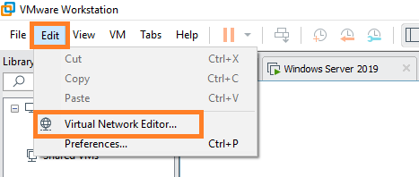

Wähle das betreffende Netzwerk aus und unten "Change Settings". Ändere nun die Netzwerkeinstellungen auf "NAT". Achtung, eventuell musst du nochmals das richtige Netzwerk auswählen.

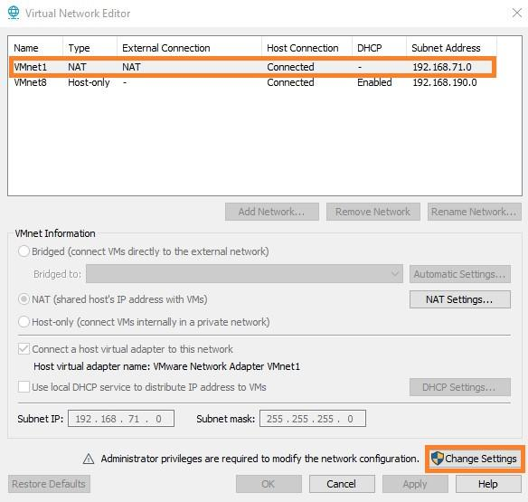
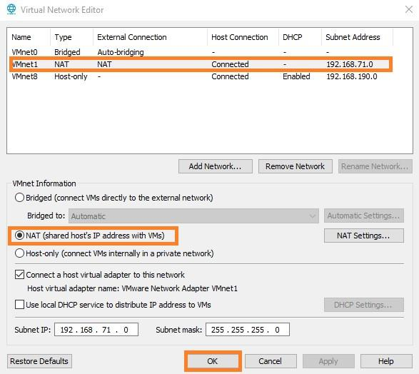

2. DNS Einstellungen anpassen

Bisher haben wir nicht mit der Außenwelt kommunizieren müssen. Da wir aber nun Updates von Microsoft beziehen wollen, müssen wir die DNS Einstellungen entsprechend anpassen. Wir müssen einen DNS-Server für externe Anfragen einstellen, da unser DNS-Server Adressen außerhalb unseres Netzwerkes nicht auflösen kann.

Öffne dazu den DNS Manager (über den Server Manager). Klicke mit der rechten Maustaste auf deine Domäne und wähle "Properties".

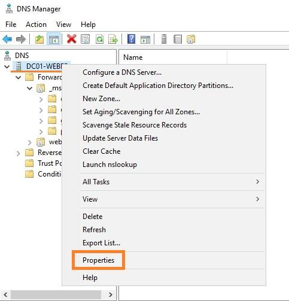

Die vorhandenen Einträge kannst du entfernen. Trage stattdessen einen öffentlichen DNS Server ein (z.B.: 1.1.1.1).

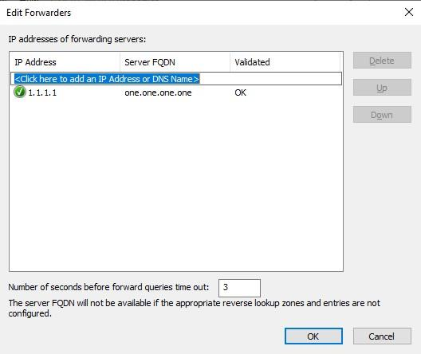

Bestätige zweimal mit OK.

3. WSUS Rolle hinzufügen und konfigurieren

Zunächst müssen wir einen Speicherort für die Updates anlegen. Es wird empfohlen, diesen nicht auf der gleichen Partition, auf welcher auch der Serverdienst installiert wurde, anzulegen. Idealerweise fügt man hierfür also der virtuellen Maschine eine neue Festplatte hinzu. Du kannst aber auch einen Pfad auf der Systemplatte wählen. Benenne den Ordner "WSUS_Updates".

Nun muss die neue Rolle hinzugefügt werden. Du wirst nach der Auswahl von "Windows Server Update Services" gefragt, ob du die benötigten Features hinzufügen möchtest. Bestätige dies mit dem Button "Add Features".

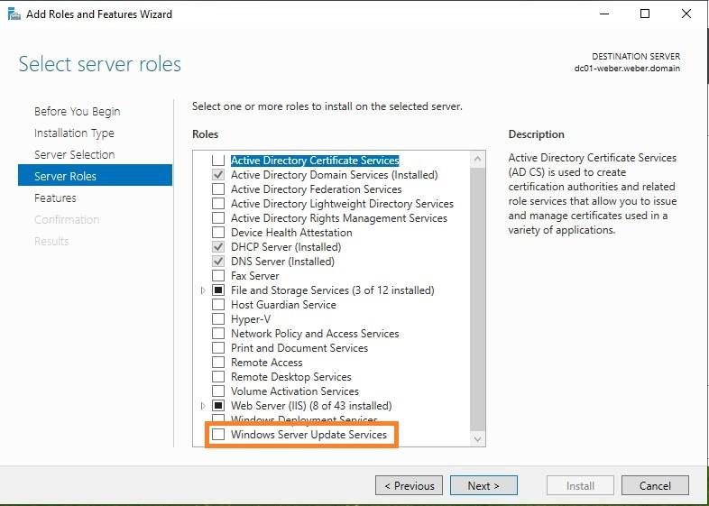
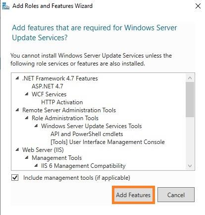

Auf der nächsten Seite (Features) solltest du dann sehen, dass die benötigten Features bereits ausgewählt wurden. Belasse die Auswahl wie vorgegeben.

Nun müssen noch die Services der Rolle hinzugefügt werden. Es sollten "WID Connectivity" und "WSUS Services" bereits ausgewählt sein. Dann muss noch der Pfad, in welchem die Updates gespeichert werden angegeben werden. Wähle hier den zuvor erstellten Ordner "WSUS_Updates" aus.

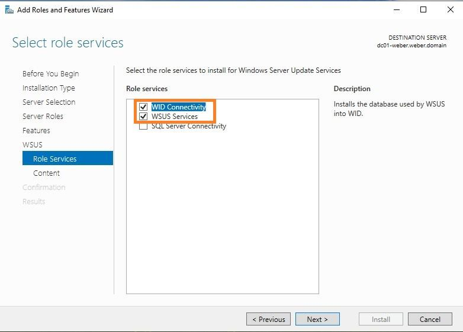
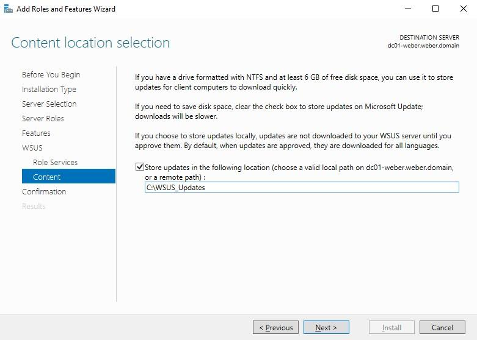

Auf der letzten Seite kannst du nochmals alle Einstellungen kontrollieren und anschließend die Rolle installieren.

Nach Abschluss der Installation siehst du im Server Manager einen Hinweis auf die "Post-Installation tasks". Führe diese aus.

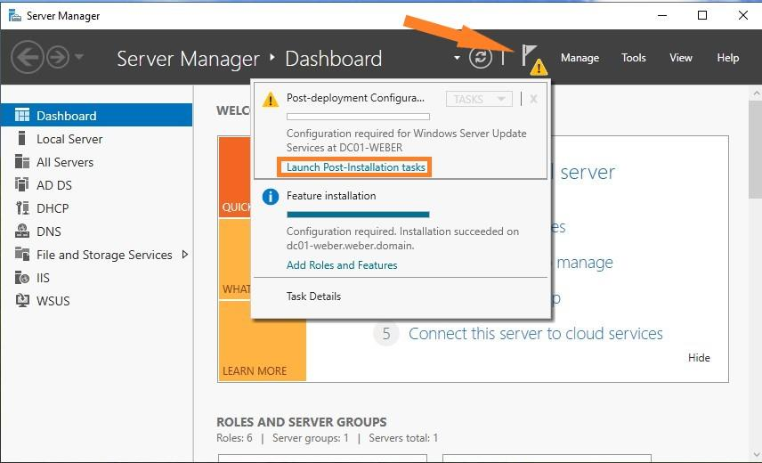

Die Konfigurationsschritte brauchen keine Userinteraktion. Nach deren Abschluss können wir nun den WSUS Dienst konfigurieren. Wähle dazu im Server Manager unter Tools den Punkt "Windows Server Update Services" aus und unter dem Eintrag deines Servers den Punkt "Options". Wähle ganz unten den "WSUS Server Configuration Wizard" aus.

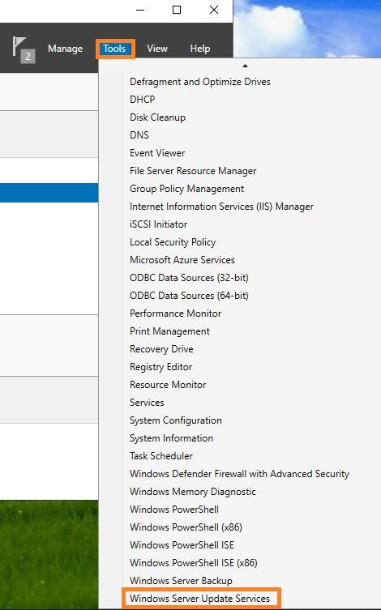
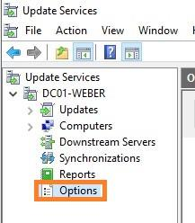

Belasse alle Einstellungen auf den ersten Seiten so wie vorgegeben. Auf der vierten Seite muss man sich nun mit dem Upstream Server verbinden. Wähle hier nun "Start Connecting" aus. Dieser Vorgang kann einige Minuten dauern. Nach erfolgreicher Verbindung müssen nun die gewünschten Sprachen ausgewählt werden. Wähle hier nur Deutsch und Englisch aus.

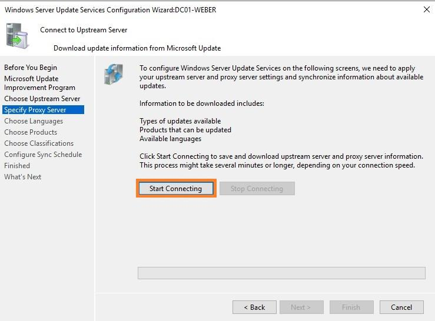
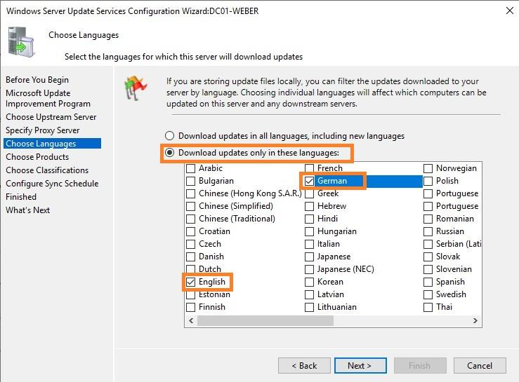

Als nächstes muss ausgewählt werden, wofür (für welche Betriebssysteme, Programme, etc.) der WSUS Server Updates laden soll. Wähle hier nur Updates für Windows Defender (relativ weit unten) aus. Würden wir die Einstellungen wie vorgegeben belassen, würden mehrere Tausend Updates gefunden werden.

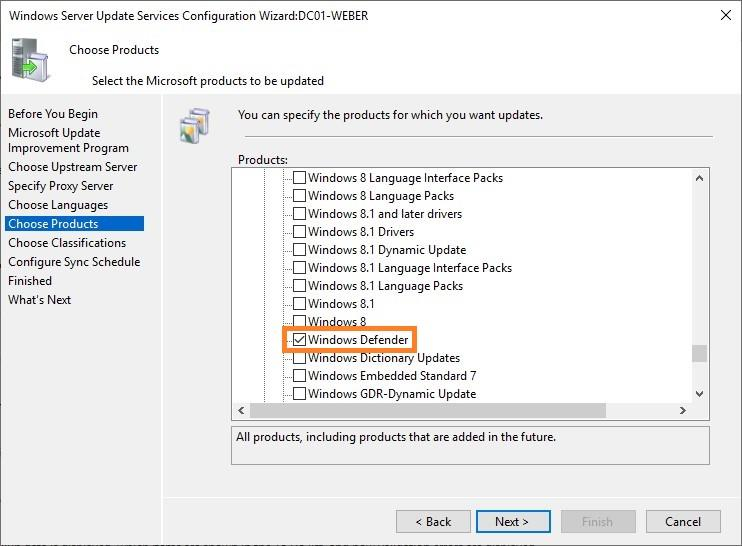

Auf der nächsten Seite wird gewählt, welche Klassifikationen von Updates geladen werden sollen. Belasse die Einstellungen wie vorgegeben.

Stelle auf der Seite danach ein, dass der Server automatisch einmal pro Tag nach neuen Updates sucht.

Zuletzt startet man die initiale Synchronisation.

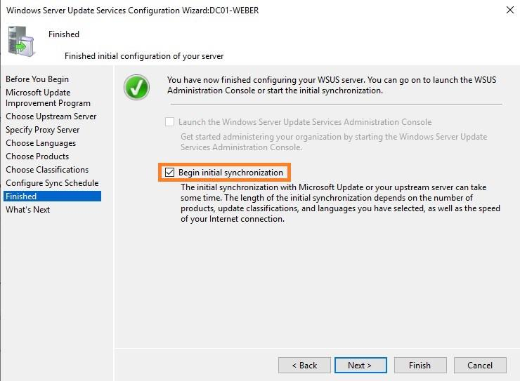

Beende danach den Wizard mit "Finish".

Unter dem Punkt "Synchronizations" solltest du den Fortschritt der Synchronisation sehen. Dieser Vorgang kann wieder einige Minuten dauern.

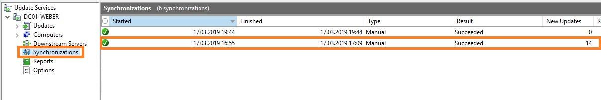

4. Gruppenrichtlinie erstellen

In der Zwischenzeit können wir eine neue Gruppenrichtlinie erstellen, welche die Clients so konfiguriert, dass diese Updates nicht mehr von Microsoft, sondern nur von unserem Server beziehen.

Lege dazu ein neues Gruppenrichtlinienobjekt (GPO) an (auf der gleichen Ebene wie das bereits zuvor erstellte GPO). Benenne das GPO "Windows Update".

Bearbeite nun das neue GPO (Kontextmenü *GPO > Edit*). Navigiere zu *Computer Configuration > Policies > Administrative Templates > Windows Components > Windows Update*.

Wähle zunächst "Specify intranet Microsoft update service location" aus. Aktiviere diese Option und trage die Adresse für den WSUS Server und den Statistikserver ein. Dabei muss auch der Port des WSUS Dienstes angegeben werden. Dieser ist in der Übersicht der WSUS Rolle ersichtlich und ist standardmäßig auf Port 8530 eingestellt.

Die URL sollte also lauten: `http://[Dein_Domain_Controller].[Deine_Domain]:8530`
Beispiel: `http://dc01-weber.weber.at:8530`

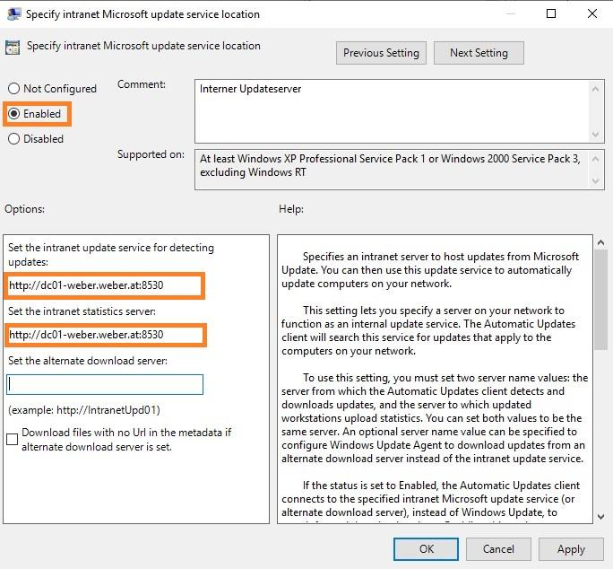

Danach aktiviere auch die Option "Do not connect to any Windows Update Internet locations".

Im Reiter "Settings" kannst du anschließend kontrollieren, ob die Einstellungen übernommen wurden.

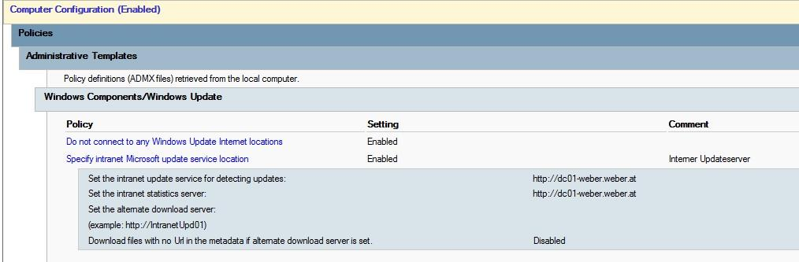

Starte nun den Client (Windows 10). Öffne eine Eingabeaufforderung und gib den Befehl `gpresult /R /Scope Computer` ein. Du solltest sehen können, dass die neue Richtlinie angewendet wird.

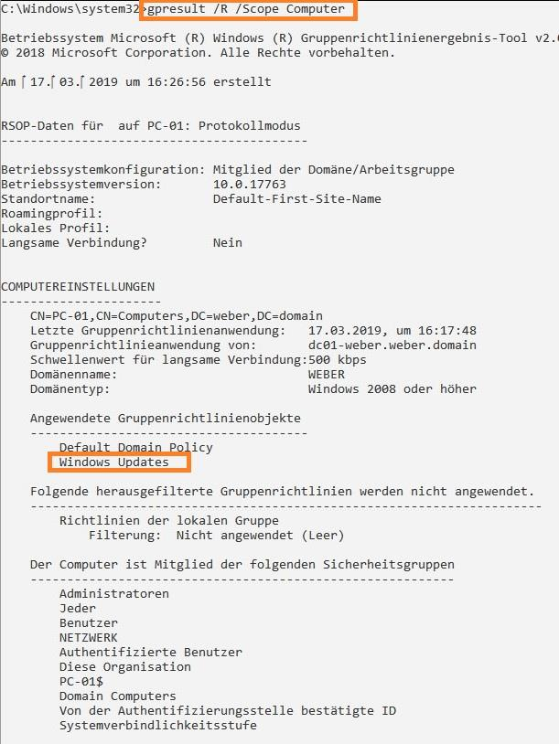

5. Updates genehmigen

Damit der Client nun Updates beziehen kann, müssen diese am Server genehmigt werden. Öffne dazu am Server wieder "Windows Server Update Services" (*Server Manager > Tools*) und wähle unter dem Namen deines Servers den Punkt *Updates > All Updates* aus.

Suche das Update *Definition Updates for Windows Defender Antivirus*.

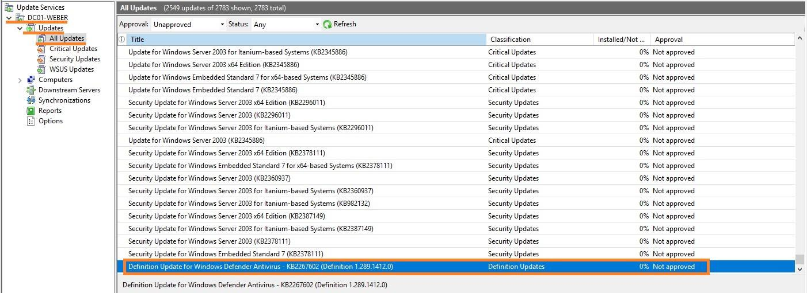

Klicke mit der rechten Maustaste auf das Update und wähle "Approve".
Es öffnet sich ein neues Fenster. Klicke links neben "All Computers" auf den Pfeil und wähle "Approved for Install". Bestätige mit "OK".

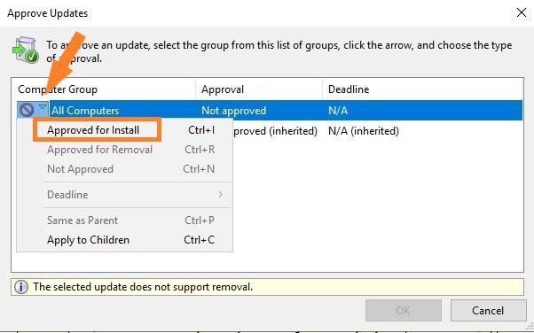

Navigiere nun am Client zu den Einstellungen für Updates (*Start > Einstellungen > Update und Sicherheit*). Du solltest sehen, dass einige Einstellungen von deiner Organisation verwaltet werden. Das bedeutet, dass unser GPO gegriffen hat. Klicke auf "Nach Updates suchen". Es sollte ein Update gefunden und installiert werden.

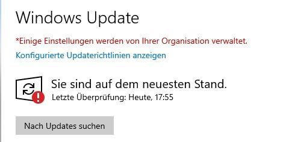
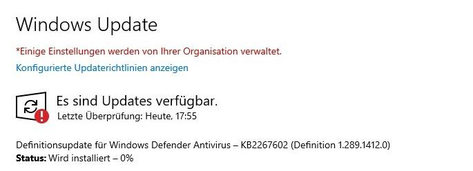

Unser Client bezieht nun künftig seine Updates vom WSUS Server. Das einzige Problem könnte nun sein, dass Updates nur nach Genehmigung verteilt werden und so wichtige Sicherheitsupdates nicht oder nur verspätet auf den Clients installiert werden.

Überlege dir, wie dieses Problem gelöst werden könnte. Tipp: Schau dir das GPO nochmals genauer an und implementiere dann deine Lösung.

### Wichtige Hilfsmittel in Windows-Umgebungen:

Mach dich zunächst [hier](https://elearning.tgm.ac.at/pluginfile.php/258336/mod_resource/content/1/Windows%20Verwaltungswerkzeuge.pdf) mit gängigen Windows-Werkzeugen vertraut: Taskmanager, Systemsteuerung, PowerShell, Eingabeaufforderung und Servermanager.

Bearbeite anschließend die folgenden Aufgaben-/Fragestellungen; dokumentiere deine Tätigkeit mit kurzen Texten/Screenshots:

#### Taskmanager

- Mach dich mit den Funktionen des Taskmanagers vertraut.
- Welche Prozesse benötigen aktuell die meisten CPU-Ressourcen?
- Suche dir 3 Hintergrundprozesse und beschreibe kurz wozu diese benötigt werden (Internet-Recherche)

#### Systemsteuerung

- Anmeldeinformationsverwaltung: Füge eine neue Windowsanmeldeinformation hinzu.

  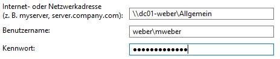

  Nun solltest du, wenn du die Adresse im Windows-Explorer eingibst, ohne weitere Anmeldung auf das Netzlaufwerk zugreifen können.
- Netzwerk- und Freigabecenter: Mit welchem Netzwerk ist der Computer verbunden?
- Verwaltung: Welche Datenträger gibt es am System und wie sind diese partitioniert?
- Systemwiederherstellung: Konfiguriere die Systemwiederherstellung und lege anschließend einen Wiederherstellungspunkt an.

#### PowerShell

- Lege einen neuen lokalen Benutzer an (Starte die PowerShell dazu als Administrator). Das cmdlet dafür heißt New-LocalUser. Das einzige verpflichtende Argument ist -User. Nach bestätigen mit Enter wird man nach einem Passwort gefragt. Mehr Informationen dazu
findest du [hier](https://www.windowspro.de/script/lokale-benutzer-gruppen-verwalten-powershell).

#### Eingabeaufforderung

- Welche aktiven Verbindungen zu entfernten Rechnern bestehen? (`netstat`)
- Welche Zuordnungen MAC-IP sind gespeichert? (`arp /a`)
- Welche Routen (Netzwerk) sind auf dem Client gespeichert? (`route`)

#### Server Manager

- Melde dich hierfür am Client mit dem Account des Domänenadministrators an. Installiere das Installationspaket WindowsTH-RSAT_WS_1803-x64.msu, welches du unter dem Netzwerkpfad `\\filesrv-schueler\SCHUELER\hit\SYT\6_Semester\Software` findest. Dieses
Update installiert den Server Manager auf deinem Client. Lass dir anschließend mithilfe des Server Managers die Benutzer und Computer der Domäne anzeigen.

### Usermanagement via PowerShell:

Arbeite die Aufgabenstellung im Dokument [Usermanagement via Powershell](resources/Usermanagement_via_PowerShell.pdf) durch.

**Anmerkung:** der letzte Teil der Aufgabenstellung - Erweiterung um generierte Passwörter, Behandlung von Sonderzeichen, mehrere Benutzer aus Datenquelle anlegen - sind nicht Teil der GK, sondern nur der EK; siehe unten.

**Erweiterungen**

### Windows Registrierungsdatenbank (Registry)

Arbeite folgende Fragestellugen schriftlich aus:
- Was ist die Windows Registrierungsdatenbank (Registry)?
- Wie kann man die Registry bearbeiten (Manuell oder mit Hilfsmitteln)?
- Warum muss man unter Umständen Änderungen in der Registry durchführen (Anhand eines konkreten Beispiels)?
- Warum sollte man die Registry von Zeit zu Zeit säubern?

### Netzwerküberwachung mit 3rd-Party Software
- Installiere die Software PRTG auf dem virtualisierten Windows 10 Client (verwende den Administratoraccount deiner Domäne)
- Konfiguriere die Software um dein Netzwerk zu überwachen
- Finde Alternativen (mind. 2) zu PRTG. Welche Unterschiede gibt es zwischen diesen Hilfsmitteln, welches würdest du wählen?

### Usermanagement via PowerShell
- Erweitere das Script zum Anlegen eines neuen Benutzers wie folgt; setze zumindest zwei der drei Vorschläge um (auch für EKV reichen zwei dieser Erweiterungen):
  - Beim Anlegen des Benutzers wird ein zufälliges Passwort vergeben (und in irgendeiner Form ausgegeben)
  - Umlaute in Namen werden im Benutzernamen ersetzt
  - Mehrere User lassen sich gleichzeitig anlegen (Userdaten aus einer Datei)

## Fragestellungen
- Zähle die wichtigsten Aufgaben eines Systemadministrators auf.
- Welche dieser Aufgaben würdest du an andere Mitarbeiter (Abteilungsleiter, Standortleiter, etc.) delegieren?
- Warum sollten Updates vor dem Verteilen im gesamten Netzwerk getestet werden?
- Warum sollte man bei diesen Tests die Benutzer miteinbeziehen?
- Welche, in Windows integrierten Hilfsmittel zum Netzwerkmanagement kennst du?
- Welche Vorteile bietet die PowerShell beim Anlegen und Verwalten von Benutzeraccounts?

## Abgabe
Die Abgabe wird elektronisch als PDF-Dokument erwartet. Dabei sollen die einzelnen Arbeitsschritte beschrieben (wo für einen Arbeitsschritt eine Anleitung exakt befolgt wurde reichen Stichworte) und die Fragen entsprechend ausgearbeitet werden. Bei dem obligatorischen Abgabegespräch wird die Dokumentation und die praktische Durchführung überprüft.

## Bewertung
Gruppengrösse: 1 Person
### Grundanforderungen **überwiegend erfüllt**
- [ ] Ausarbeitung der Fragestellungen
### Grundanforderungen **zur Gänze erfüllt**
- [ ] Vollständige Bearbeitung der grundlegenden Aufgabenstellungen
### Erweiterte Anforderungen **überwiegend erfüllt**
- [ ] Bearbeitung mindestens zwei der drei erweiterten Aufgabenstellungen (Registry, Netzwerküberwachung, Usermanagement)
### Erweiterte Anforderungen **zur Gänze erfüllt**
- [ ] Vollständige Bearbeitung der erweiterten Aufgabenstellungen

## Quellen
* "Systemtechnik Theorie Unterlagen" elearning; zuletzt besucht 2020-02-15; [online](https://elearning.tgm.ac.at/course/view.php?id=1939)

---
**Version** *20210214v1*
