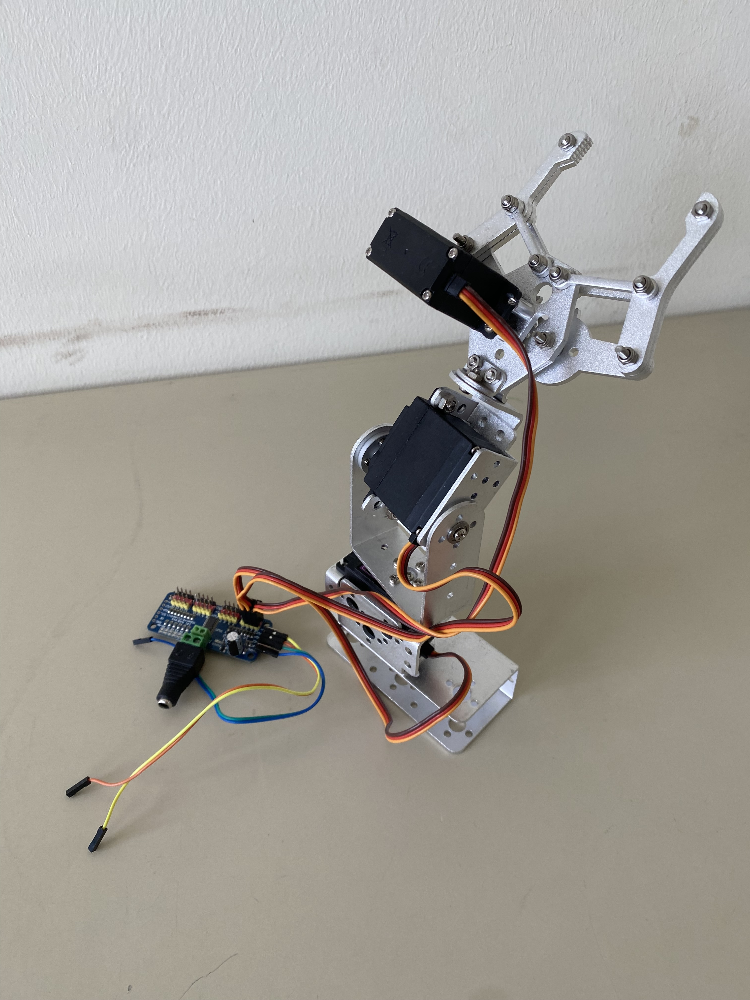
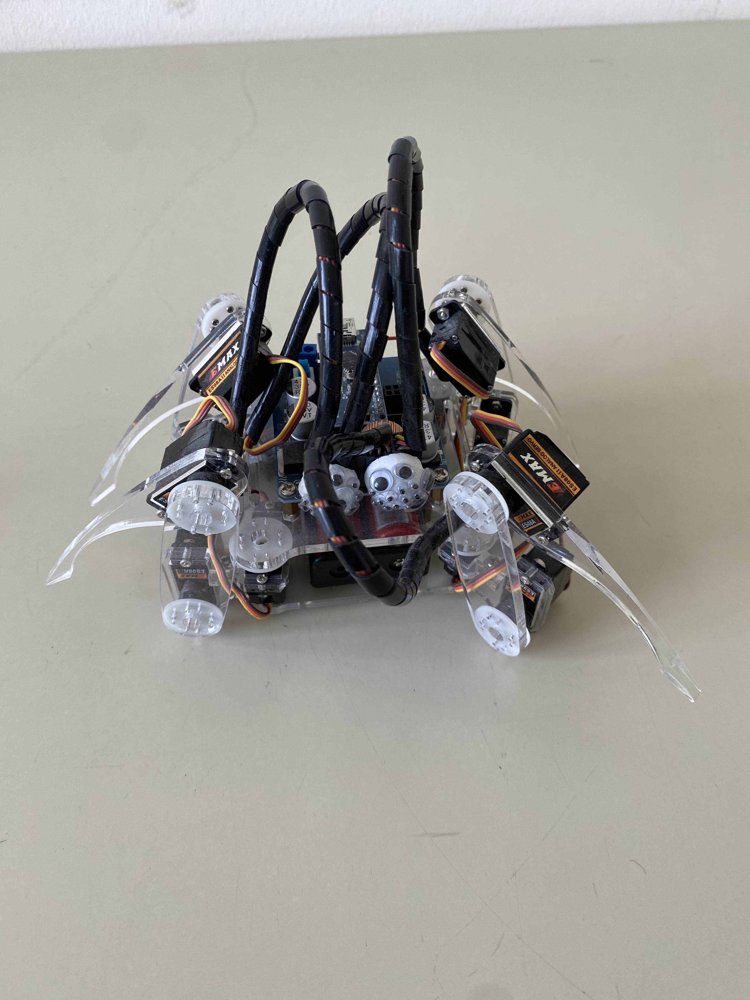
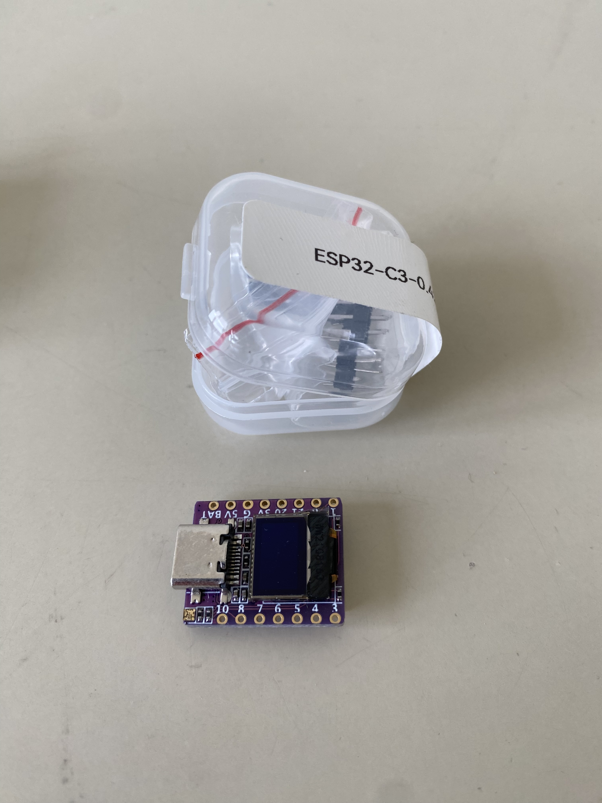
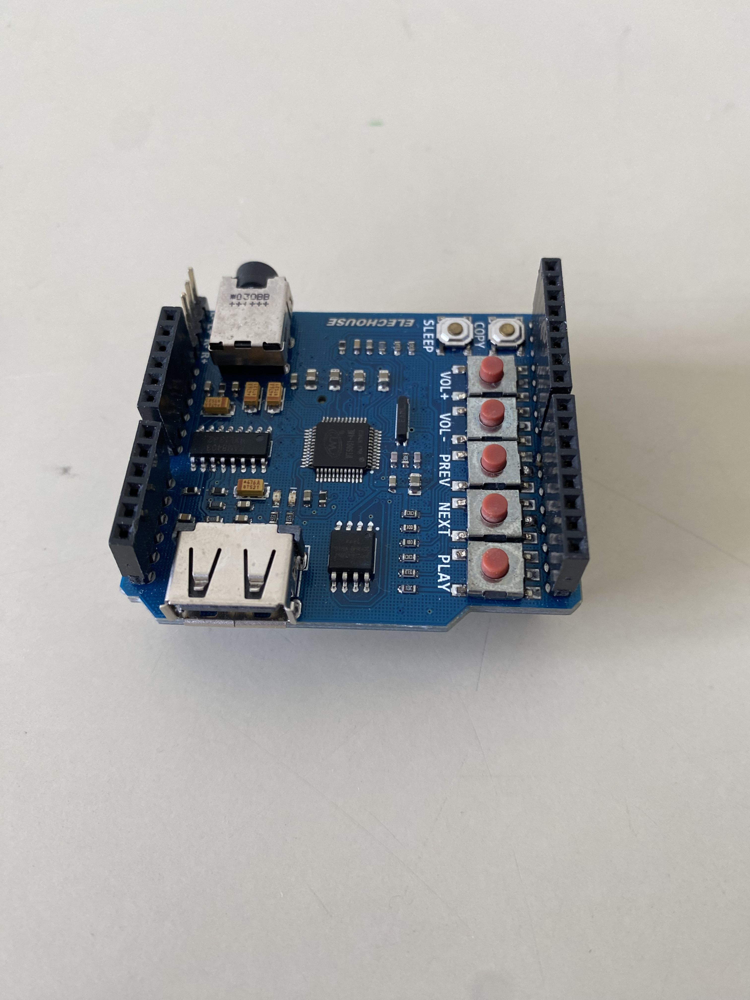
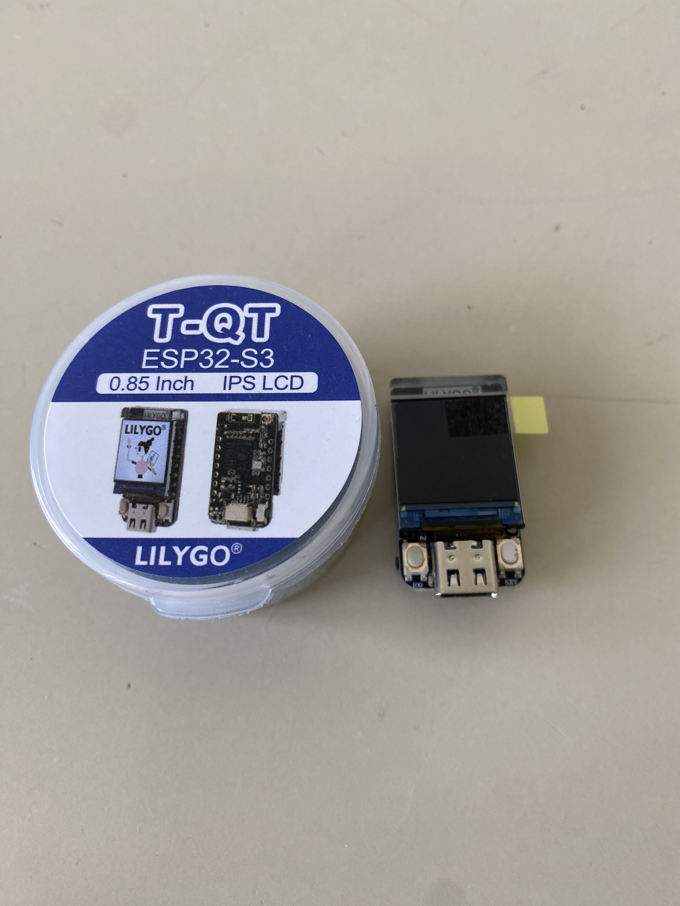
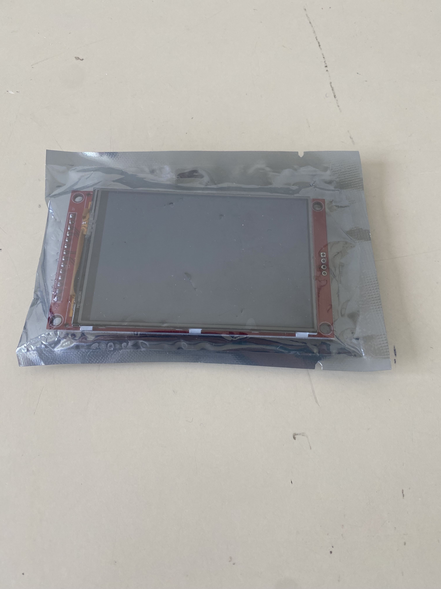
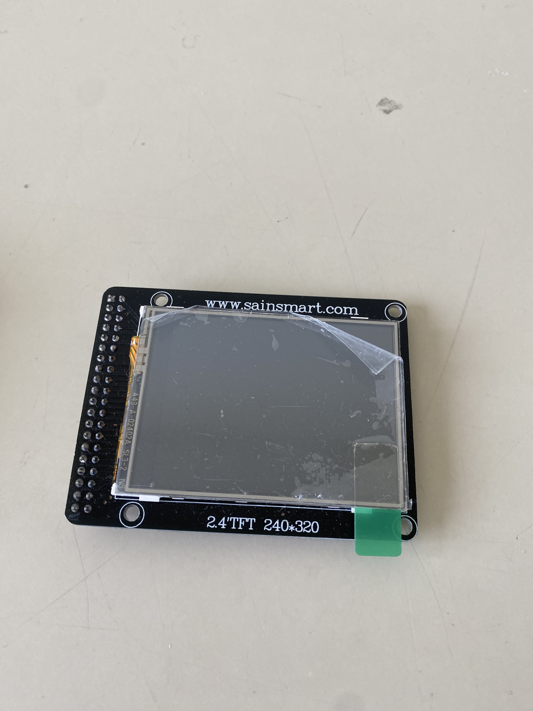
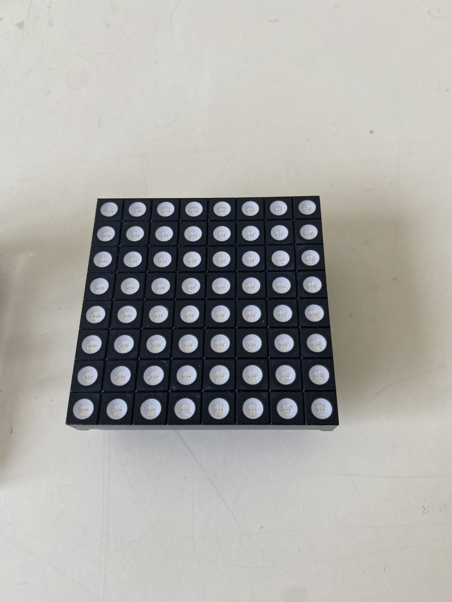
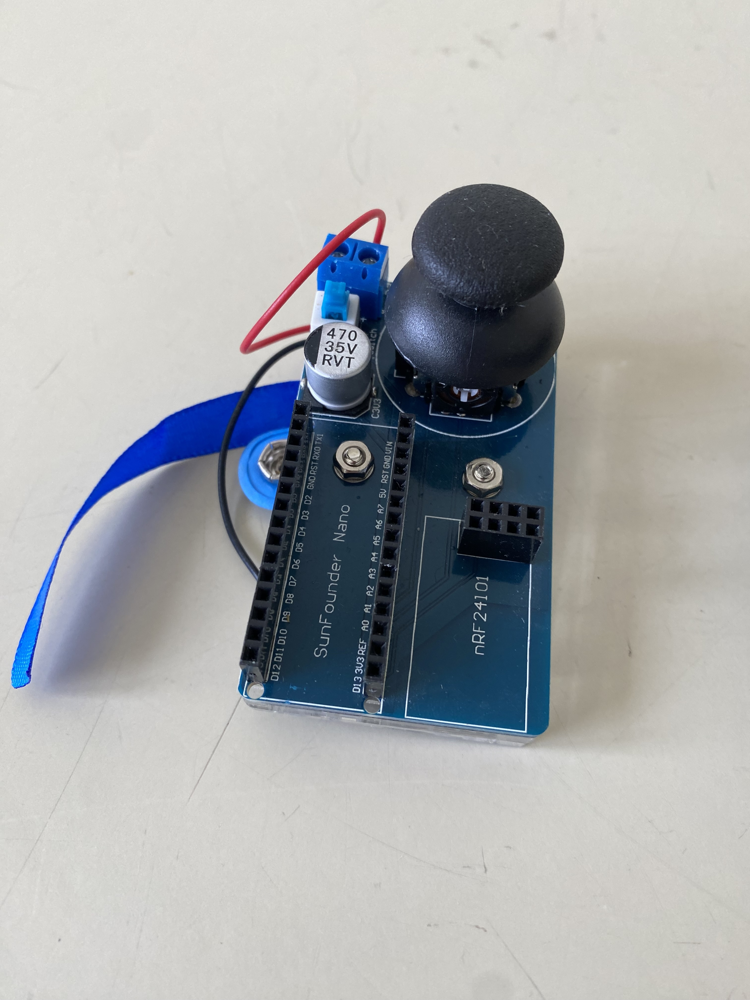

---
hide:
  - navigation

---

# Komponenten

Neben generischen elektronischen Komponenten wie Widerständen, Kondensatoren, Dioden, LEDs, usw. liegen auch komplexere Bauteile, sowie Projekte zum fortführen im Labor zum ausleihen auf.

| ID   | Bild                          | Bezeichnung                                                  | Daten                                            | Projektvorschläge                                            | Anzahl | Verfügbarkeit | Ort  | Besitzer |
| ---- | ----------------------------- | ------------------------------------------------------------ | ------------------------------------------------ | ------------------------------------------------------------ | ------ | ------------- | ---- | -------- |
|      |  | Einfacher 2DOF Aluminium Roboter Arm mit Greifer             | 3 starke Servomotoren mit Motortreiber Board     | Ansteuerung mit µC, Kombinierbar mit mobilen Roboter, Steuern über Wifi | 1      |               |      | HOED     |
|      |  | Quadruped Spider Robot                                       | 12 Mini Servos mit Treiberboard für Arduino Nano | Ansteuerung mit ESP32, Steuern über Wifi                     | 1      |               |      | HOED     |
|      |  | ESP32 C3 ??                                                  | ??                                               | Anzeigen von Sensordaten über Wifi, Wearables                | 1      |               |      | HOED     |
|      |  | Arduino Uno MP3 Board                                        | Zum Abspielen von MP3 Files über Klinke von USB  | Alarmanlage,...                                              | 1      |               |      | HOED     |
|      |  | [Lilygo ESP32 S3 0,85 LCD](https://openelab.io/products/lilygo-t-qt-pro-esp32-module) |                                                  | Anzeigen von Sensordaten über Wifi, Wearables                | 1      |               |      | HOED     |
|      |  |                                                              |                                                  |                                                              | 1      |               |      | HOED     |
|      |  |                                                              |                                                  |                                                              | 1      |               |      | HOED     |
|      |  | 8x8 RGB LED Matrix für Arduino Uno                           |                                                  | Snake, Emoticon Display                                      | 1      |               |      | HOED     |
|      |  | Joystick RF Arduino Nano Fernbedienung                       |                                                  | Roboter Fernsteuerung                                        | 1      |               |      | HOED     |

