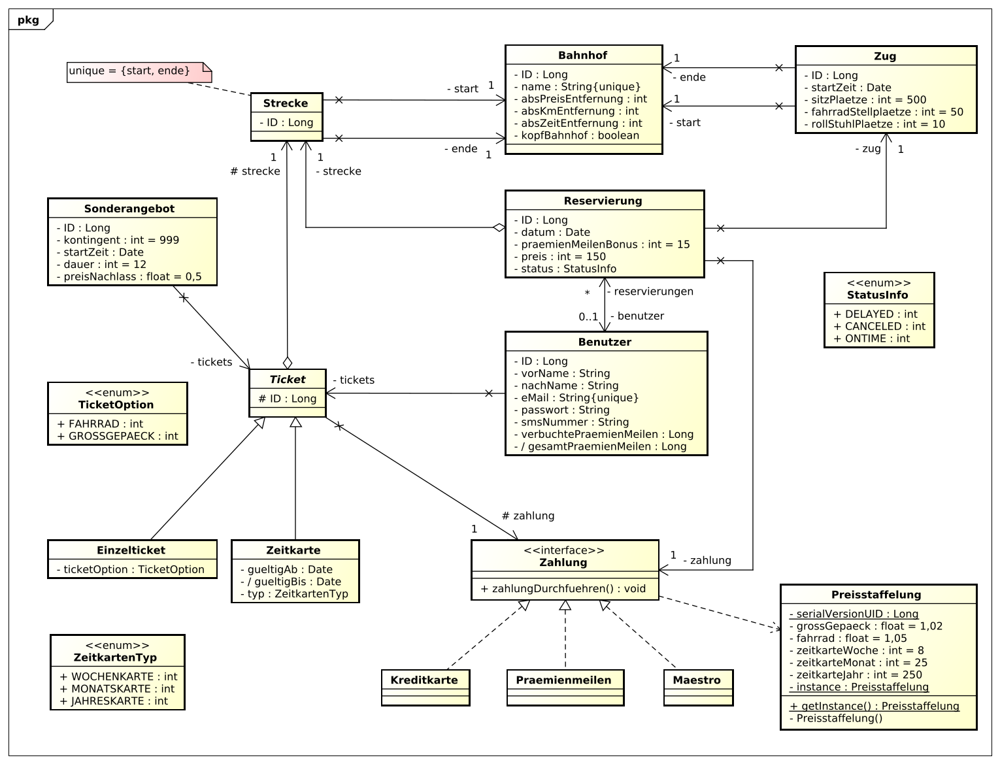

# Webframeworks - Komponentenbasierte Implementierung "Westbahn mit ORM" - Taskdescription

## Einführung
Diese Übung zeigt die Anwendung von komponentenbasierter Programmierung mittels Webframeworks.

## Ziele
Das Ziel dieser Übung ist die automatisierte Persistierung und Verwendung von Objekten eines vorgegebenen Domänenmodells mittels eines Frameworks. Dabei sollen die CRUD-Operationen der verwendeten API zur Anwendung kommen.

Die Persistierung soll mittels der Java Persistence API (JPA) realisiert werden.

## Kompetenzzuordnung
**GK SYT8 Dezentrale Systeme | Webframeworks | Komponenten-basierte Implementierung**  
* "dezentrale Systeme mit Hilfe von webbasierten Frameworks umsetzen"

**EK SYT8 Dezentrale Systeme | Webframeworks | Komponenten-basierte Implementierung**  
* "unterschiedliche Komponenten von Frameworks zur Umsetzung von komplexen, verteilten Problemstellungen einsetzen"

## Voraussetzungen
* Grundlagen zu Java und das Anwenden neuer Application Programming Interfaces (APIs)
* Verständnis über relationale Datenbanken und dessen Anbindung mittels höherer Programmiersprachen (JDBC/ODBC)
* Verständnis von UML und Build-Tools

## Aufgabenstellung
Erstellen Sie von folgendem Modell Persistenzklassen und implementieren Sie diese mittels JPA:

**Suche**  
Die Suche nach Zügen muss auf jeden Fall die Auswahl des Abfahrts- und Ankunftsortes (nur folgende Bahnhöfe sind möglich: Wien Westbhf, Wien Hütteldorf, St. Pölten, Amstetten, Linz, Wels, Attnang-Puchheim, Salzburg) ermöglichen. Dies führt zur Anzeige der möglichen Abfahrten, die zur Vereinfachung an jedem Tag zur selben Zeit stattfinden. Des weiteren wird auch die Dauer der Fahrt angezeigt.

In dieser Liste kann nun eine gewünschte Abfahrtszeit ausgewählt werden. Die Auswahl der Zeit führt zu einer automatischen Weiterleitung zum Ticketshop.

Um sich die Auslastung der reservierten Sitzplätze anzusehen, muss bei dem Suchlisting noch das Datum ausgewählt werden. Dieses Service steht jedoch nur registrierten Benutzern zur Verfügung.

**Ticketshop**  
Man kann Einzeltickets kaufen, Reservierungen für bestimmte Züge durchführen und Zeitkarten erwerben. Dabei sind folgende Angaben notwendig:

* Einzeltickets: Strecke (Abfahrt/Ankunft), Anzahl der Tickets, Optionen (Fahrrad, Großgepäck)
* Reservierung: Strecke (Abfahrt/Ankunft), Art der Reservierung (Sitzplatz, Fahrrad, Rollstuhlstellplatz), Reisetag und Zug (Datum/Uhrzeit)
* Zeitkarte: Strecke, Zeitraum (Wochen- und Monatskarte)

Um einen Überblick zu erhalten, kann der Warenkorb beliebig befüllt und jederzeit angezeigt werden. Es sind keine Änderungen erlaubt, jedoch können einzelne Posten wieder gelöscht werden.

Die Funktion „Zur Kassa gehen“ soll die Bezahlung und den Ausdruck der Tickets sowie die Zusendung per eMail/SMS ermöglichen. Dabei ist für die Bezahlung nur ein Schein-Service zu verwenden um zum Beispiel eine Kreditkarten- bzw. Maestrotransaktion zu simulieren.

**Prämienmeilen**  
Benutzer können sich am System registrieren um getätigte Käufe und Reservierungen einzusehen. Diese führen nämlich zu Prämienmeilen, die weitere Vergünstigungen ermöglichen. Um diese beim nächsten Einkauf nützen zu können, muss sich der Benutzer einloggen und wird beim „Zur Kassa gehen“ gefragt, ob er die Prämienmeilen für diesen Kauf einlösen möchte.

**Instant Notification System der Warteliste**  
Der Kunde soll über Änderungen bezüglich seiner Reservierung (Verspätung bzw. Stornierung) mittels ausgesuchtem Service (eMail bzw. SMS) benachrichtigt werden. Bei ausgelasteten Zügen soll auch die Möglichkeit einer Anfrage an reservierte Plätze möglich sein. Dabei kann ein Zuggast um einen Platz ansuchen, bei entsprechender Änderung einer schon getätigten Reservierung wird der ansuchende Kunde informiert und es wird automatisch seine Reservierung angenommen.

**Sonderangebote**  
Für festzulegende Fahrtstrecken soll es ermöglicht werden, dass ein fixes Kontingent von Tickets (z.b.: 999) zu einem verbilligten Preis (z.b.: 50% Reduktion) angeboten wird. Diese Angebote haben neben dem Kontingent auch eine zeitliche Beschränkung. Der Start wird mit Datum und Uhrzeit festgelegt. Die Dauer wird in Stunden angegeben. Diese Angebote werden automatisch durch Ablauf der Dauer beendet.

### Task 1 - Mapping
Schreiben Sie für alle oben definierten Klassen und Relationen entsprechende Hibernate JPA Implementierungen (javax.persistence.*). Bis auf die Klasse Reservierung sollen dafür die Annotationen verwendet werden. Die Klasse Reservierung soll mittels XML Mapping definiert werden.

### Task 2 - Named Queries
Schreiben Sie folgende NamedQueries (kein plain SQL und auch keine Inline-Queries) für das Domänenmodell aus Task1. Die Queries sollen die entsprechenden Parameter akzeptieren und die gewünschten Typen zurückliefern:

a) Finde alle Reservierungen für einen bestimmten Benutzer, der durch die eMail-Adresse definiert wird.  
b) Liste alle Benutzer auf, die eine Monatskarte besitzen.  
c) Liste alle Tickets für eine bestimmte Strecke aus (durch Anfangs- und Endbahnhof definiert), wo keine Reservierungen durchgeführt wurden.  

### Task 3 - Validierung
Alle Constraints der einzelnen Entitäten sollen verifiziert werden. Hierfür soll die Bean Validation API verwendet werden. Folgende Einschränkungen sollen überprüft werden:

a) Zug und Strecke können nicht denselben Start- und Endbahnhof besitzen.  
b) Die eMail des Benutzers soll ein gängiges eMail-Pattern befolgen.  
c) Die Startzeit eines Sonderangebotes kann nicht in der Vergangenheit liegen.  
d) Der Name eines Bahnhofs darf nicht kürzer als zwei und nicht länger als 150 Zeichen sein. Sonderzeichen sind bis auf den Bindestrich zu unterbinden.  

## Fragestellungen
* Was ist ORM und wie kommt dabei JPA zum Einsatz?
* Welche Vorteile bietet die komponentenbasierte Implementierung in einer Webapplikation?
* Was ist die PersistenceUnit und wo wird diese definiert?
* Wozu dient die application.properties und wo muss diese abgelegt werden?
* Welche Annotationen kommen häufig bei Entitätstypen zum Einsatz? Welche Eckpunkte müssen beachtet werden?
* Wie ruft man in JavaSE den EntityManager auf?
* Welche Methoden benötigt man für CRUD und worauf muss man dabei achten?

## Abgabe
Die Fragestellungen sollen im File **research.md** abgehandelt werden. Die entsprechenden Konfigurationsdateien und Deployment-Anweisungen sind im **README.md** festzuhalten. Etwaiger Programmcode ist ebenfalls zu dokumentieren. Implementierungen müssen entsprechend beschrieben und leicht deployable sein!

### Classroom Git-Repository
[Hier](https://github.com/500) finden Sie das Abgabe-Repository zum Entwickeln und Commiten Ihrer Lösung. Sollte der Server durch einen unerwarteten Umstand daran gehindert worden sein, die an ihn gesendete Anfrage zu erfüllen, muss der Link zu Beginn des Labors persönlich beantragt werden!

## Bewertung
Gruppengrösse: 1 Person
### Grundanforderungen **überwiegend erfüllt**
- [ ] Ausarbeitung der Fragestellungen
- [ ] Dokumentation und Beschreibung der angewendeten Schnittstelle
### Grundanforderungen **zur Gänze erfüllt**
- [ ] Task 1 - Mapping
### Erweiterte Anforderungen **überwiegend erfüllt**
- [ ] Task 2 - Named Queries
- [ ] Ausreichende Testobjekte zur Validierung der Persistierung
### Erweiterte Anforderungen **zur Gänze erfüllt**
- [ ] Task 3 - Validierung
- [ ] Überprüfung der funktionalen Anforderungen mittels Regressionstests

## Quellen
* "Hibernate User Guide - Guide covering most user facing concepts and APIs of Hibernate"; JBoss; last visited 2021-03-03; [online](https://docs.jboss.org/hibernate/orm/5.4/userguide/html_single/Hibernate_User_Guide.html)
* "Hibernate Object/Relational Mapping"; JBoss; last visited 2021-02-16; [online](http://hibernate.org/orm/)
* "Hibernate ORM Documentation"; JBoss; last visited 2021-02-16; [online](http://hibernate.org/orm/documentation/)
* "Hibernate ORM 5.4 Quickstart"; JBoss; last visited 2021-02-16; [online](http://docs.jboss.org/hibernate/orm/5.4/quickstart/html_single/)
* "Overview of the Java Persistence API"; last visited 2021-02-16; [online](https://javaee.github.io/tutorial/persistence-intro001.html)
* "Java Persistence API: XML Schemas"; last visited 2022-05-30; [online](https://www.oracle.com/webfolder/technetwork/jsc/xml/ns/persistence/index.html)
* "HTML5-valid e-mail address"; W3C; last visited 2021-02-16; [online](https://www.w3.org/TR/2012/CR-html5-20121217/forms.html#valid-e-mail-address)

---
**Version** *20210303v3*

