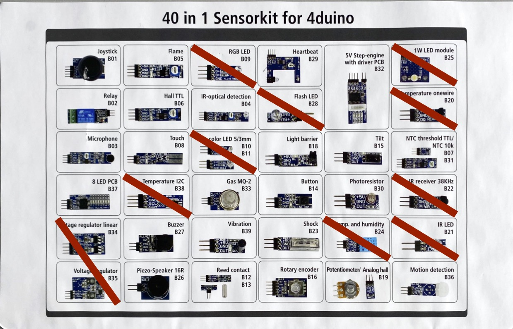

---
hide:
  - navigation

---

# ITP Projekt Wetterstation

Es soll eine einfache Wetterstation realisiert werden, welche die Daten auf einem einfachen Webservice zugänglich macht.
#### Sensoren
Dazu soll zuerst der DHT11 verwendet werden, um Temperatur und Luftfeuchtigkeit zu messen. Zusätzlich soll ein weiterer Sensor verwendet werden, welcher von der Lehrperson zufällig verteilt wird. Die Daten sollen in einem sinnvollen Intervall erfasst werden und über eine einfache Webseite einsehbar sein, welche der Mikrocontroller auf einem eigenen einfachen Webserver bereitstellt. Die Daten sollen möglichst bereinigt werden (durchschnitt über mehrere Messungen, unmögliche Ausreißer herausfiltern). Zu jedem Messwert soll auch ein Zeitstempel erfasst werden. Die Uhrzeit kann über Internet synchronisiert werden.
#### Webserver
Ein Wi-Fi Manager soll verwendet werden, um den Mikrocontroller mit einem Wi-Fi zu verbinden oder selbst einen Accesspoint zur Verfügung zu stellen. Über die IP-Adresse soll die Webseite, das Webinterface aufrufbar sein, welche mit einfachem Design die aktuellen Messdaten anzeigt.
#### Status LED
Die RGB LED des ESP32 soll den aktuellen Status der Wetterstation darstellen. Möglich wäre: Rot - kein WLAN, Blau - Messung im Gange, Orange - Zu hohe Temperatur, … Es müssen mindestens 3 Status realisiert werden, es sollen auch andere gewählt werden. Die Status LED soll im Webinterface ein/ausschaltbar sein.
## Varianten
Jeder Gruppe wird eine Variante zugeteilt.
##### 1. einfacher Graph
Auf dem Webinterface sollen die historischen Daten in einem einfachen Graphen dargestellt werden. Es sollen am Mikrocontroller nicht alle Daten gespeichert werden, sondern sinnvolle historische Durchschnitte gebildet werden (z. B. letzte Stunde nur alle 5min, letzte Woche nur jede Stunde, …). Die Daten müssen nicht über einen Reset hinaus gespeichert werden können.
##### 2. API
Die Daten sollen zusätzlich über eine API in JSON Format abrufbar sein. Z.B.:

```json
http://192.168.4.1/api/data
{
	"timestamp": "2025-02-01T20:05:02",
	"temperature": 19.3,
	"humidity": 52.3,
	"sensor": 20.4
}

http://192.168.4.1/api/data/temperature
{
	"timestamp": "2025-02-01T20:05:02",
	"temperature": 19.3
}

http://192.168.4.1/api/data/humidity
{
	"timestamp": "2025-02-01T20:05:02",
	"humidity": 52.3
}

http://192.168.4.1/api/data/sensor
{
	"timestamp": "2025-02-01T20:05:02",
	"sensor": 20.4
}
```
##### 3. Datenbank
Die Daten sollen nach jedem Messvorgang an eine MySQL Datenbank gesendet werden. Es sollen alle Messwerte und ein Zeitstempel in einem einfachen Schema gespeichert werden. Verwende diese [Anleitung](https://tgm-hit.github.io/insy-exercises/1.Semester/13_Datenbanksystem_Installation/GEK13_Datenbanksystem_Installation/#mariadb-container-installation) von *MariaDB Container Installation* bis einschließlich *Datagrip Konfiguration* um in Docker eine Datenbank zu installieren (diese kann nächstes Jahr für INSY verwendet werden). Führe folgendes (oder angepasstes) Script in der Datenbank aus um eine passende Tabelle zu erstellen.

```sql
DROP DATABASE IF EXISTS wetterstation;
CREATE DATABASE wetterstation;
USE wetterstation;

CREATE TABLE messdaten (
    id INT auto_increment PRIMARY KEY,
    timestamp TIMESTAMP,
    temperatur FLOAT,
    luftfeuchtigkeit FLOAT,
    sensor FLOAT
);
```

##### 4. RGB Colorpicker
Auf dem Webinterface soll die Farben der Status durch ein einfaches grafisches Element zur Auswahl der Farbe aus wählbar und permanent gespeichert werden können (auch über Reset hinaus).
##### 5. Display
Die Daten und der Zustand soll über ein Display, welches am Mikrocontroller angeschlossen ist, angezeigt werden. Das Display wird von der Schule zur Verfügung gestellt.
## Nice-To-Haves
Für eine bessere Bewertung können noch weitere Features integriert werden

* Sleep Mode: Mikrocontroller soll zwischen den Messungen in den Sleep Mode wechseln, um Energie zu sparen
* Telegram/Discord/ … Bot: Daten sollen über einen Bot an ein Nachrichtenservice gesendet werden.
* Smartphone App (Remote XY, Blynk, …): App-Plattform soll verwendet werden, um Daten am Smartphone einsehen zu können.
* Weitere Varianten integrieren: Siehe oben
* ... Gerne auch eigene Ideen

## Abgabe

### Systemtechnik

Für SYT ist das Projekt vollständig technisch dokumentiert laut [Dokumentationsrichtlinie](https://elearning.tgm.ac.at/pluginfile.php/18149/mod_resource/content/1/Dokumentationsrichtlinie.md) auf Github hochzuladen. Abzugeben hier ist nur der Github Link zum Projekt. Eine Abgabe pro Gruppe ist ausreichend, Gruppenmitlieder sind in der Dokumentation anzugeben. Dokumentation als Readme.md, vollständiger Schaltplan ([fritzing](https://fritzing.org/), [tinkercad](https://www.tinkercad.com/), [wokwi](https://wokwi.com/)) und Komponenten Liste, Fotos vom Projekt müssen vorhanden sein. Code als .ino.

## Quellen

[1] „Allnet 4duino_40in1_Kit1 Sensorkit 1 Set Passend für (Entwicklungskits): Arduino kaufen“. Zugegriffen: 18. Februar 2025. [Online]. Verfügbar unter: [https://www.conrad.de/de/p/allnet-4duino-40in1-kit1-sensorkit-1-set-passend-fuer-entwicklungskits-arduino-2233140.html](https://www.conrad.de/de/p/allnet-4duino-40in1-kit1-sensorkit-1-set-passend-fuer-entwicklungskits-arduino-2233140.html)

[2] „Arduino - DHT11 | Arduino Tutorial“, Arduino Getting Started. Zugegriffen: 18. Februar 2025. [Online]. Verfügbar unter: [https://arduinogetstarted.com/tutorials/arduino-dht11](https://arduinogetstarted.com/tutorials/arduino-dht11)

[3] „Blynk: a low-code IoT software platform for businesses and developers“. Zugegriffen: 18. Februar 2025. [Online]. Verfügbar unter: [https://blynk.io](https://blynk.io)

[4] „Chart.js“. Zugegriffen: 18. Februar 2025. [Online]. Verfügbar unter: [https://www.w3schools.com/js/js_graphics_chartjs.asp](https://www.w3schools.com/js/js_graphics_chartjs.asp)

[5] „ESP32 - MySQL“, ESP32 Tutorial. Zugegriffen: 18. Februar 2025. [Online]. Verfügbar unter: [https://esp32io.com/tutorials/esp32-mysql](https://esp32io.com/tutorials/esp32-mysql)

[6] „ESP32 - OLED“, ESP32 Tutorial. Zugegriffen: 18. Februar 2025. [Online]. Verfügbar unter: [https://esp32io.com/tutorials/esp32-oled](https://esp32io.com/tutorials/esp32-oled)

[7] S. Santos, „ESP32 Deep Sleep with Arduino IDE and Wake Up Sources | Random Nerd Tutorials“. Zugegriffen: 18. Februar 2025. [Online]. Verfügbar unter: [https://randomnerdtutorials.com/esp32-deep-sleep-arduino-ide-wake-up-sources/](https://randomnerdtutorials.com/esp32-deep-sleep-arduino-ide-wake-up-sources/)

[8] S. Santos, „ESP32 with DHT11/DHT22 Temperature and Humidity Sensor using Arduino IDE | Random Nerd Tutorials“. Zugegriffen: 18. Februar 2025. [Online]. Verfügbar unter: [https://randomnerdtutorials.com/esp32-dht11-dht22-temperature-humidity-sensor-arduino-ide/](https://randomnerdtutorials.com/esp32-dht11-dht22-temperature-humidity-sensor-arduino-ide/)

[9] Tiago, „ESP32-C3 Super Mini Real-Time Clock with OLED Display“. Zugegriffen: 1. März 2025. [Online]. Verfügbar unter: [https://www.edgemicrotech.com/esp32-c3-super-mini-real-time-clock-with-oled-display/](https://www.edgemicrotech.com/esp32-c3-super-mini-real-time-clock-with-oled-display/)

[10] ESP32Async/ESPAsyncWebServer. (1. März 2025). C++. ESP32 Asynchronous Networking. Zugegriffen: 1. März 2025. [Online]. Verfügbar unter: [https://github.com/ESP32Async/ESPAsyncWebServer](https://github.com/ESP32Async/ESPAsyncWebServer)

[11] „How To Create a Color Picker“. Zugegriffen: 18. Februar 2025. [Online]. Verfügbar unter: [https://www.w3schools.com/howto/howto_html_colorpicker.asp](https://www.w3schools.com/howto/howto_html_colorpicker.asp)

[12] T. Digital, „Interfacing WS2812B Neopixel LED Strip with ESP32“, theoryCIRCUIT - Do It Yourself Electronics Projects. Zugegriffen: 18. Februar 2025. [Online]. Verfügbar unter: [https://theorycircuit.com/esp32-projects/interfacing-ws2812b-neopixel-led-strip-with-esp32/](https://theorycircuit.com/esp32-projects/interfacing-ws2812b-neopixel-led-strip-with-esp32/)

[13] „Remote control Arduino - RemoteXY“. Zugegriffen: 18. Februar 2025. [Online]. Verfügbar unter: [https://remotexy.com/](https://remotexy.com/)

[14] title, „Send Messages to Discord from ESP32 with Discord Webhooks“. Zugegriffen: 18. Februar 2025. [Online]. Verfügbar unter: [https://www.espboards.dev/blog/send-message-from-esp32-to-discord/](https://www.espboards.dev/blog/send-message-from-esp32-to-discord/)  

[15] tzapu, tzapu/WiFiManager. (1. März 2025). C++. Zugegriffen: 1. März 2025. [Online]. Verfügbar unter: [https://github.com/tzapu/WiFiManager](https://github.com/tzapu/WiFiManager)



---

**Version** *20250301v4*