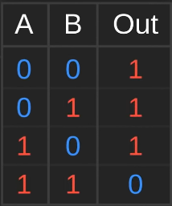
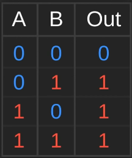
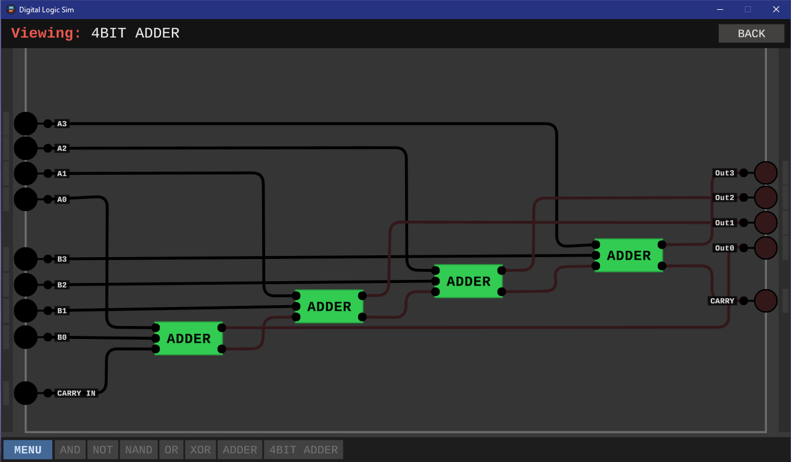

---
hide:
  - navigation
---

# "*Digital Logic Sim*" - Taskdescription

## Kompetenzzuordnung

#### SYT3 Grundlagen der Informatik - Computerarchitekturen

* CPU - den Aufbau und den grundlegenden Befehlsablauf eines Prozessors beschreiben

## Detaillierte Aufgabenbeschreibung

Bitte versuche alle wichtigen Information kurz und prägnant in einem Grafiz zu verschriftlichen.

[Digital Logic Sim](https://sebastian.itch.io/digital-logic-sim)

[Youtube Playlist](https://www.youtube.com/playlist?list=PLFt_AvWsXl0dPhqVsKt1Ni_46ARyiCGSq)

### ALU

1. NAND (AND --> NOT)

2. OR (2xNOT --> NAND)

3. XOR (OR+NAND --> AND)

4. ADDER

5. 4Bit ADDER

6. ALU

### Register

1. SR LATCH (2. Video)

2. NOR

3. D LATCH

4. REGISTER

5. D-FLIP-FLOP

6. 1-BIT REGISTER

7. 4-BIT REGISTER

### 7-Segment Display

1. 7 Segment Driver

### Bus and Tri-State

1. Bus Buffer

2. Simple CPU

---

**Version**  *20240814v2*
