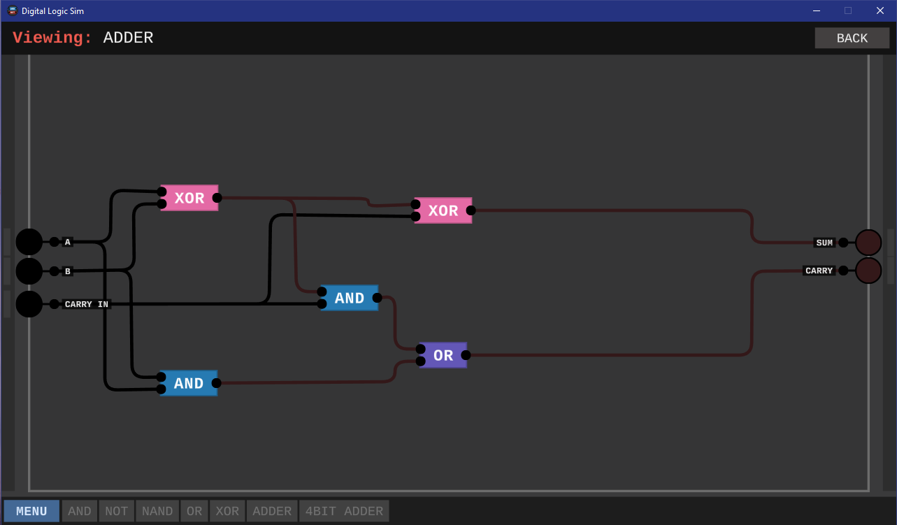
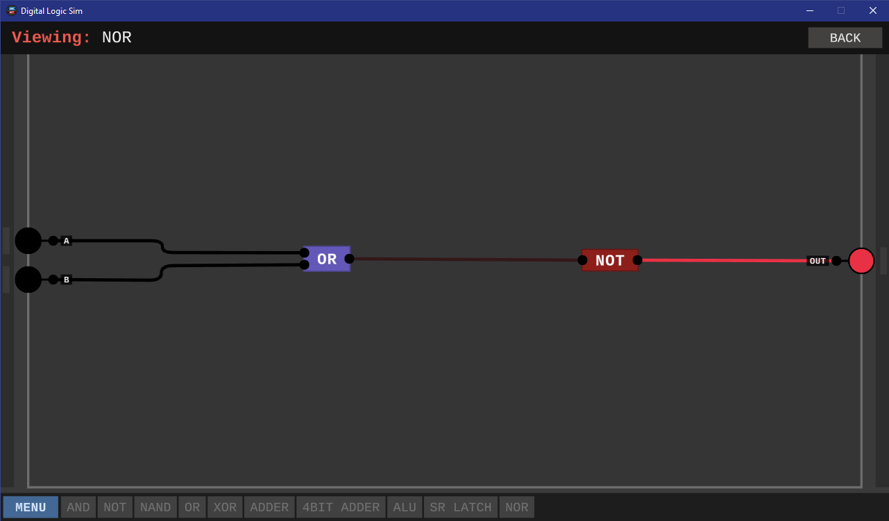
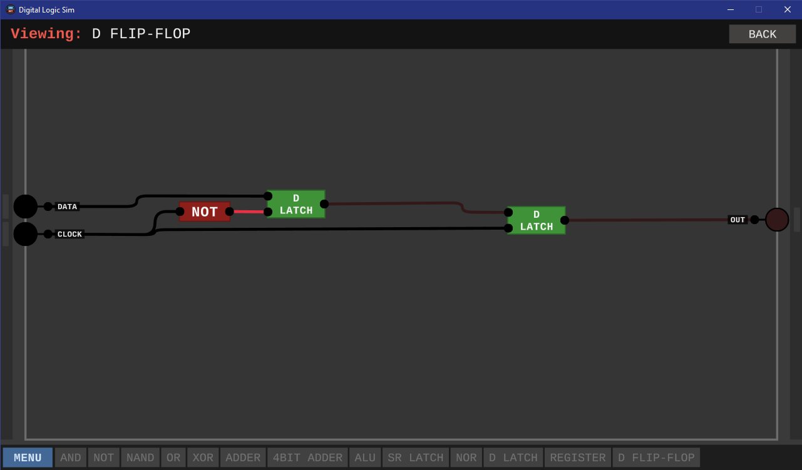

---
hide:
  - navigation
---

# "*Digital Logic Sim*" - Taskdescription

## Kompetenzzuordnung

#### SYT3 Grundlagen der Informatik - Computerarchitekturen

* CPU - den Aufbau und den grundlegenden Befehlsablauf eines Prozessors beschreiben

## Detaillierte Aufgabenbeschreibung

Bitte versuche alle wichtigen Information kurz und prägnant in einem Grafiz zu verschriftlichen.

[Digital Logic Sim](https://sebastian.itch.io/digital-logic-sim)

[Youtube Playlist](https://www.youtube.com/playlist?list=PLFt_AvWsXl0dPhqVsKt1Ni_46ARyiCGSq)

### ALU

1. Ein IN-1 --> NAND (von dem einen Eingang in beide NAND Eingänge)

| A    | NOT  |
| ---- | ---- |
| 0    | 1    |
| 1    | 0    |

2. AND: NAND --> NOT

| A    | B    | AND  |
| ---- | ---- | ---- |
| 0    | 0    | 0    |
| 0    | 1    | 0    |
| 1    | 0    | 0    |
| 1    | 1    | 1    |

3. OR: NOT/NOT --> NAND

| A    | B    | AND  |
| ---- | ---- | ---- |
| 0    | 0    | 0    |
| 0    | 1    | 1    |
| 1    | 0    | 1    |
| 1    | 1    | 1    |

4. XOR (OR+NAND --> AND)

5. ADDER

| CARRY IN | A    | B    | CARRY | SUM  |
| -------- | ---- | ---- | ----- | ---- |
| 0        | 0    | 0    | 0     | 0    |
| 0        | 0    | 1    | 0     | 1    |
| 0        | 1    | 0    | 0     | 1    |
| 0        | 1    | 1    | 1     | 0    |
| 1        | 0    | 0    | 0     | 1    |
| 1        | 0    | 1    | 1     | 0    |
| 1        | 1    | 0    | 1     | 0    |
| 1        | 1    | 1    | 1     | 1    |

5. 4Bit ADDER

6. ALU

7-Segment Später hinzufügen

### Register

1. SR LATCH (2. Video)

| S (Set) | R (Reset) | Q               |
| ------- | --------- | --------------- |
| 0       | 0         | Q-1 (Speichern) |
| 0       | 1         | 0               |
| 1       | 0         | 1               |
| ~~1~~   | ~~1~~     | (undefined)     |

2. NOR

| A    | B    | Q    |
| ---- | ---- | ---- |
| 0    | 0    | 1    |
| 0    | 1    | 0    |
| 1    | 0    | 0    |
| 1    | 1    | 0    |

3. D LATCH

| DATA | STORE | Q               |
| ---- | ----- | --------------- |
| 0    | 0     | Q-1 (Speichern) |
| 0    | 1     | 0               |
| 1    | 0     | Q-1 (Speichern) |
| 1    | 1     | 1               |

5. D-FLIP-FLOP (Flankengesteuert)

6. 1-BIT REGISTER

7. 4-BIT REGISTER

7 Segment später hinzufügen

### 7-Segment Display

1. 7 Segment Driver

Save -> Namen geben -> Customize -> 7 Segment hinzufügen

### Bus and  Tri-State

1. Bus Buffer

2. Simple CPU

Weiterführend: [Turing Complete - Steam](https://store.steampowered.com/app/1444480/Turing_Complete/)

---

**Version**  *20251207v4*
