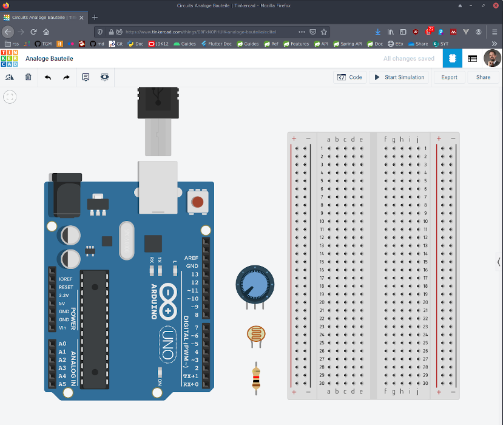

---
hide:
  - navigation
---

# Embedded Devices "Sensoren" - Taskdescription

## Einführung
Diese Aufgabe soll den Einsatz von Sensoren und analogen Bauteilen mit Mikrocontrollern verständlich machen.

## Ziele
Das Ziel ist es Messdaten über einen analogen Input zu verarbeiten und auszugeben.

## Voraussetzungen
* Grundkenntnisse über die sichere Verwendung von Elektronikbauteilen
* Grundverständnis von digitalen Systemen
* Kenntnis einer Programmiersprache (z.B. Java)

## Detaillierte Aufgabenbeschreibung

#### Übung 1: Sensoren

Es soll der **ESP32** verwendet werden um einen analogen Widerstandswert auszulesen, diesen zu verarbeiten und auf der seriellen Schnittstelle auszugeben. Dabei soll ein externer Fotowiderstand und ein Potentiometer an den analogen Ports A0 und A1 angeschlossen werden. Die gemessenen Werte müssen entsprechend interpretiert [8] und auf der seriellen Schnittstelle mit einer Geschwindigkeit von 9600 bits/s ausgegeben werden. Dafür muss das erstellte Programm auf den Mikrocontroller übertragen werden. Dies kann entweder mit der [Arduino IDE](https://www.arduino.cc/en/Main/Software) als Desktop-Applikation erfolgen.

Die Schaltung soll vor dem physischen Aufbau in einer Simulationsumgebung getestet und entsprechend dokumentiert werden. Dabei bietet sich die Umgebung von [Tinkercad](https://www.tinkercad.com) an:

#### Übung 2: Serial

In einem weiteren Schritt soll die Schaltung mit eine LED erweitert (oder die LED_BUILTIN verwendet) werden (verwende dazu *map()*). Dessen Helligkeit soll sich wahlweise mit dem Sensorwert des Potentiometers oder des LDRs ändern. Zeige die Sensorwerte am Serial Plotter an ("Label1:Value1\tLabel2:Value2"). 

## Abgabe
Die Abgabe wird elektronisch als generiertes PDF-Dokument erwartet. Dabei sollen die einzelnen Arbeitsschritte beschrieben und die Fragen entsprechend ausgearbeitet werden.
Bei dem obligatorischen Abgabegespräch wird die Dokumentation und die praktische Durchführung überprüft.

## Bewertung
Gruppengröße: 1 Person

### Anforderungen **überwiegend erfüllt**
- [ ] Übung 1: die beiden Sensorwerte werden am Serial Monitor ausgegeben

### Anforderungen **zur Gänze erfüllt**
- [ ] Übung 2: die Helligkeit der LED ändert sich mit den Sensorwerten
- [ ] Die Sensorwerte werden am Serial Plotter ausgegeben

## Quellen
[1] "Mikrocontroller und Mikroprozessoren", T. Ungerer und U. Brinkschulte, 3. Auflage Berlin Heidelberg New York: Springer-Verlag, 2010.  
[2] "What is a Microcontroller?" Core Electronics Video, 2017-02-17; zuletzt besucht am 2019-10-17 [online](https://core-electronics.com.au/tutorials/arduino-workshop-for-beginners.html)  
[3] "Mikrokontroller" mikrocontroller.net; zuletzt besucht am 2019-10-17 [online](https://www.mikrocontroller.net/articles/Mikrocontroller)  
[4] "Built-In Examples Blink" Arduino Tutorials, 2015-07-28; zuletzt besucht am 2019-10-17 [online](https://www.arduino.cc/en/Tutorial/Blink)  
[5] "Statische Fehler bei der A/D-Wandlung kompensieren" Elektronikpraxis Vogel [online](https://www.elektronikpraxis.vogel.de/statische-fehler-bei-der-a-d-wandlung-kompensieren-a-107429/)  
[6] "Potentiometer" Elektronik Kompendium [online](https://www.elektronik-kompendium.de/sites/bau/1501011.htm)  
[7] "Arduino API Reference" [online](https://www.arduino.cc/reference/en/language/functions/analog-io/analogread/)  
[8] "AVR Tutorial ADC" mikrocontroller.net [online](https://www.mikrocontroller.net/articles/AVR-Tutorial:_ADC)  

---

**Version** *20240815v2*
